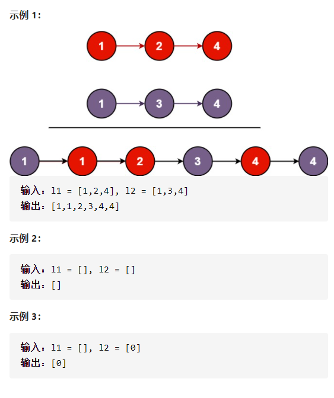

合并两个升序链表



详细思路

建立哑结点，遍历两条链表，哪个节点小就接在哑结点后面，一条合并完后第二条剩余的直接接在后面

精确定义

cur1第一条链表需要判断的节点

cur2第二条链表需要判断的节点

cur3合并完成的链表的最后一个节点

dummy合并完成的链表的哑结点

```c
class Solution {
public:
    ListNode* mergeTwoLists(ListNode* l1, ListNode* l2) {
        ListNode*dummy=new ListNode(0);
        ListNode*cur1=l1,*cur2=l2,*cur3=dummy;
        while(cur1&&cur2){
            if(cur1->val<=cur2->val){
                cur3->next=cur1;
                cur1=cur1->next;
            }
            else{
                cur3->next=cur2;
                cur2=cur2->next;
            }
            cur3=cur3->next;
        }
        cur3->next=(cur1?cur1:cur2);
        return dummy->next;
    }
};

```

