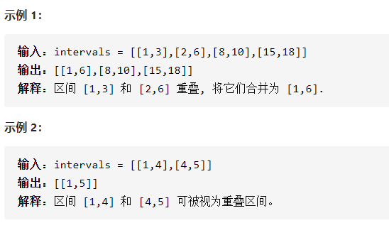
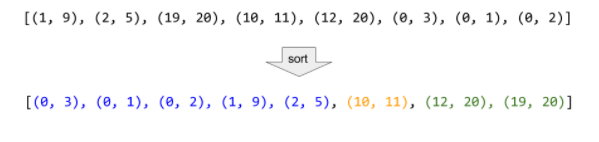

合并区间




详细思路

排序，vector<pair<int,int>>保存答案，如果空或者L>ans.back()[1]，放进去作为新的尾巴，否则就是可以合并的，尾巴的right更新最大值



精确定义

{L,R}需要判断的

```c
class Solution {
public:
    vector<vector<int>> merge(vector<vector<int>>& intervals) {
        int n=intervals.size();
        sort(intervals.begin(),intervals.end());
        vector<vector<int>>ans;
        for(int i=0;i<n;i++){
            int L=intervals[i][0],R=intervals[i][1];
            if(ans.empty()||L>ans.back()[1])ans.push_back({L,R});
            else if(R>ans.back()[1])ans.back()[1]=R;
        }
        return ans;
    }
};
```


踩过的坑，二维，每行第一个元素，直接

​    sort(intervals.begin(),intervals.end());

第2个元素

1. bool cmp1(const vector<int> &a, const vector<int> &b)
2. {
3. ​	return a[1] > b[1];
4. }
5.  
6.  
7. sort(viA.begin(), viA.end(), cmp1)