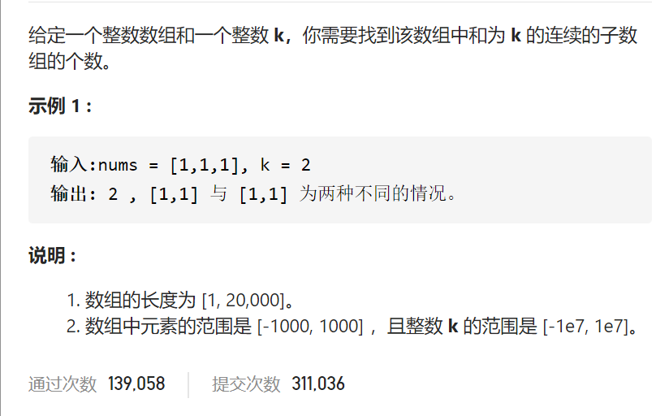
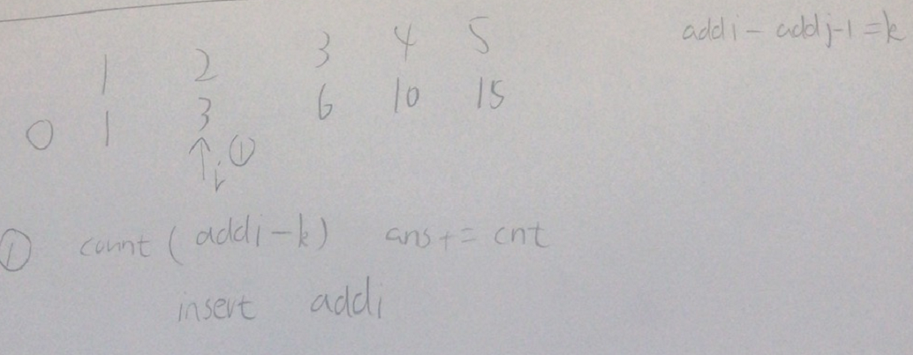

和为K的子数组



抽象图一二ij



```c
class Solution {
public:
    int subarraySum(vector<int>& nums, int k) {
        int n=nums.size();
        vector<int>add(n+1,0);
        for(int i=1;i<=n;i++)add[i]=add[i-1]+nums[i-1];
        int ans=0;
        unordered_map<int,int>num2cnt;
        for(int i=0;i<=n;i++){
            if(num2cnt.count(add[i]-k))ans+=num2cnt[add[i]-k];
            num2cnt[add[i]]++;

        }
        return ans;
    }
};
```

