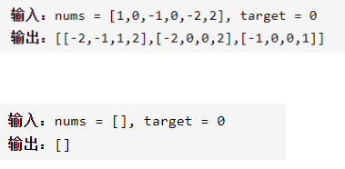

四数之和



详细思路

sort，长度小于4直接返回，对于第一个元素，向右找到第二个元素，向右两侧往中间找到第三第四个元素，小了left++大了right--去重，剪枝

精确定义

i第一个元素

j第二个元素

left第三个元素

right第四个元素

ans所有满足的四元组

```c
class Solution {
public:
    vector<vector<int>> fourSum(vector<int>& nums, int target) {
        if(nums.size()<4)return{};
        vector<vector<int>>ans;
        sort(nums.begin(),nums.end());
        for(int i=0;i<nums.size()-3;i++){
            if(i-1>=0&&nums[i]==nums[i-1])continue;
            if((long long)nums[i]+nums[i+1]+nums[i+2]+nums[i+3]>(long long)target)break;
            if(nums[i]+nums[nums.size()-3]+nums[nums.size()-2]+nums[nums.size()-1]<target)continue;
            for(int j=i+1;j<nums.size()-2;j++){
                if(j-1>=i+1&&nums[j]==nums[j-1])continue;
                int left=j+1,right=nums.size()-1;
                while(left<right){
                    if(left-1>j+1&&nums[left]==nums[left-1]){
                        left++;
                        continue;
                    }
                    if(right+1<=nums.size()-1&&nums[right]==nums[right+1]){
                        right--;
                        continue;
                    }
                    if(nums[i]+nums[j]+nums[left]+nums[right]==target){
                        ans.push_back({nums[i],nums[j],nums[left],nums[right]});
                        left++,right--;
                    }
                    else if(nums[i]+nums[j]+nums[left]+nums[right]<target){
                        left++;
                    }else if(nums[i]+nums[j]+nums[left]+nums[right]>target){
                        right--;
                    }
                }
            }
        }
        return ans;
    }
};
```


踩过的坑

if((long long)nums[i]+nums[i+1]+nums[i+2]+nums[i+3]>(long long)target)break;