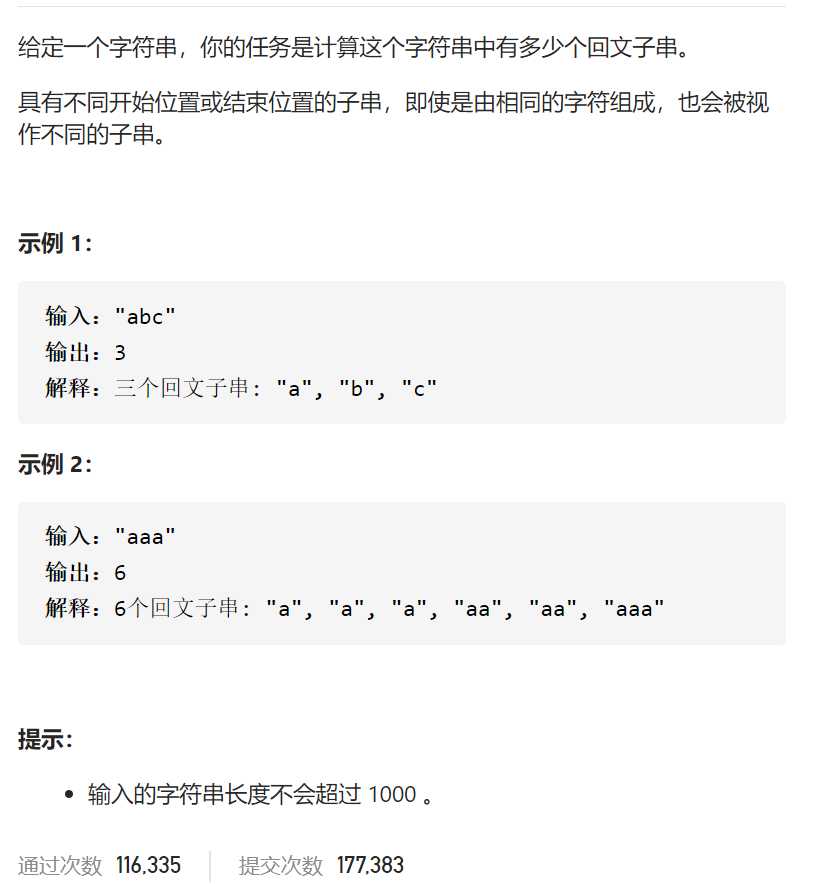
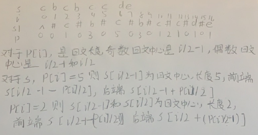
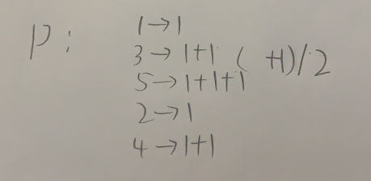

回文子串

抽象图一二ij





```c
class Solution {
public:
    int countSubstrings(string s) {
        if(s=="")return 0;
        string s1=process(s);
        int n=s1.size();
        vector<int>P(n,0);
        int centen=0,right=0;
        for(int i=1;i<n-1;i++){
            if(right>i){
                int iMirror=2*centen-i;
                P[i]=min(right-i,P[iMirror]);
            }else P[i]=0;
            while(s1[i+P[i]+1]==s1[i-P[i]-1])P[i]++;
            if(i+P[i]>right){
                centen=i;
                right=i+P[i];
            }
        }
        int ans=0;
        for(int i=0;i<n;i++){
            ans+=(P[i]+1)/2;
        }
        return ans;
    }
    string process(string s){
        int n=s.size();
        if(n==0)return "^$";
        string ans="^";
        for(int i=0;i<n;i++)ans+='#',ans+=s[i];
        ans+="#$";
        return ans;
    }
};
```

