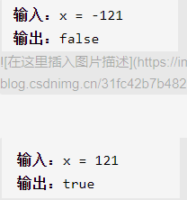

回文数



简单思路

输入的数不断截取最低位放到新数字最低位，直到老数字小于等于新数字，如果新数字等于老数字说明偶位数且回文，如果新数字切掉个位后等于老数字说明奇位数且回文

精确定义

left是前半段数字

right是后半段数字翻转

```c
class Solution {
public:
    bool isPalindrome(int x) {
        if(x<0)return false;
        if(x!=0&&x%10==0)return false;
        int left=x,right=0;
        while(left>right){
            right=right*10+left%10;
            left/=10;
        }
        //x回文且偶位数
        if(left==right)return true;
        //x回文且奇位数
        if(left==right/10)return true;
        return false;
    }
};
```

