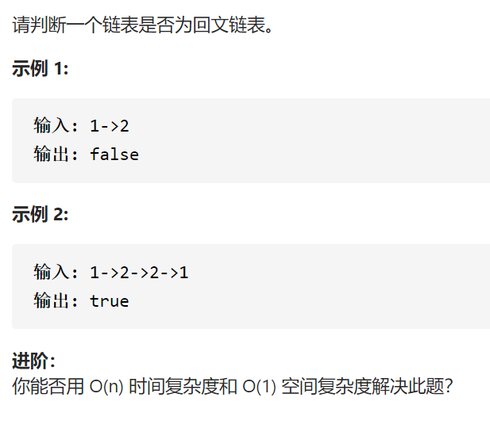

回文链表



变量简洁正确完整思路

快慢找到中点，翻转，同时比较，恢复

```c
class Solution {
public:
    bool isPalindrome(ListNode* head) {
        if(!head->next)return true;
        ListNode*S=head,*F=head;
        while(F->next&&F->next->next){
            S=S->next;
            F=F->next->next;
        }
        ListNode*cur=S->next;
        S->next=nullptr;
        ListNode*dummy=new ListNode(-1,cur);
        while(cur->next){
            ListNode*pre=dummy->next;
            ListNode*nex=cur->next;
            cur->next=nex->next;
            dummy->next=nex;
            nex->next=pre;
        }
        S->next=dummy->next;
        ListNode*cur1=head,*cur2=S->next;
        while(cur2){
            if(cur1->val!=cur2->val)return false;
            cur2=cur2->next;
            cur1=cur1->next;
        }
        return true;
    }
};
```


变量简洁正确完整思路

保存到vector nums，向中间夹

```c
class Solution {
public:
    bool isPalindrome(ListNode* head) {
        vector<int>nums;
        ListNode*cur=head;
        while(cur){
            nums.push_back(cur->val);
            cur=cur->next;
        }
        int left=0,right=nums.size()-1;
        while(left<right){
            if(nums[left]!=nums[right])return false;
            left++,right--;
        }
        return true;
    }
};

```

