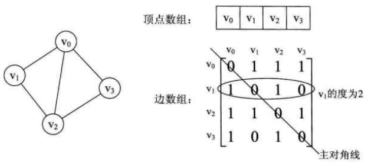
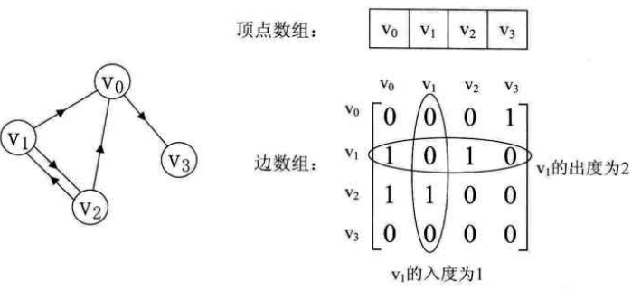
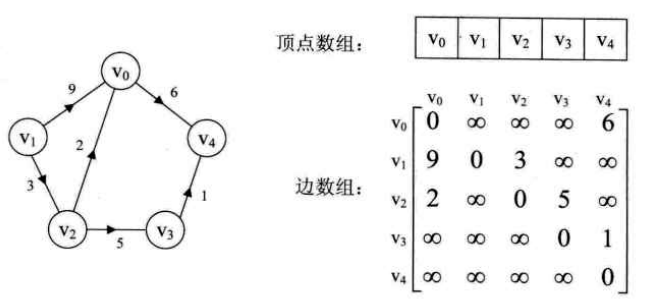
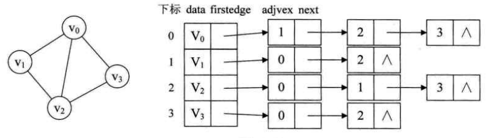
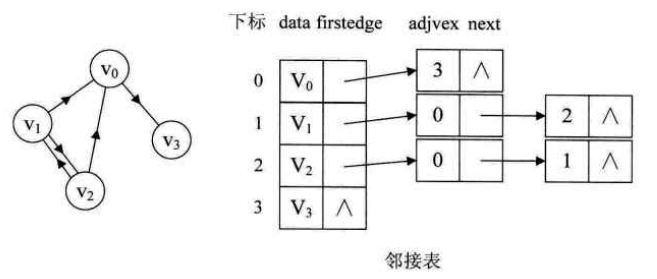
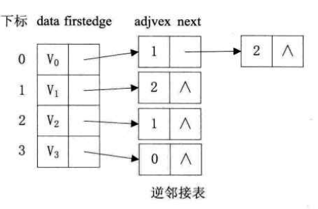
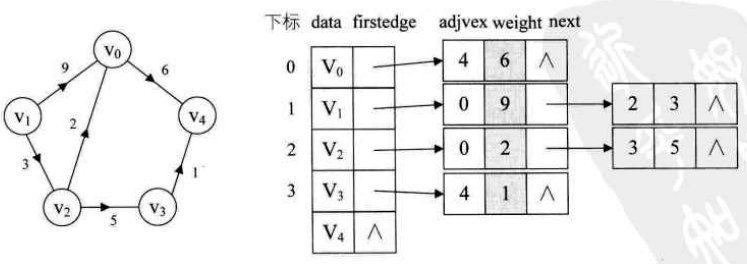
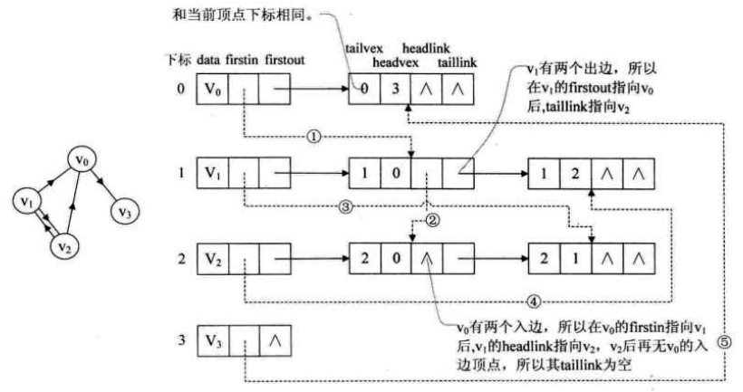
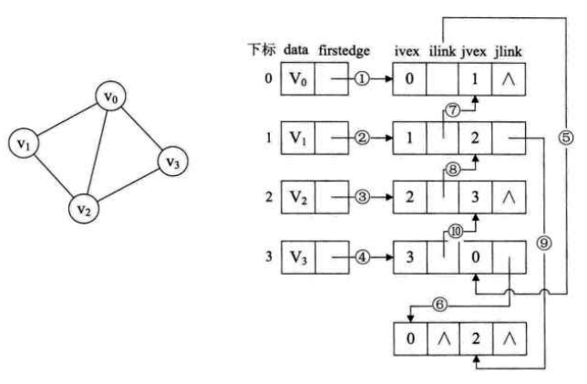
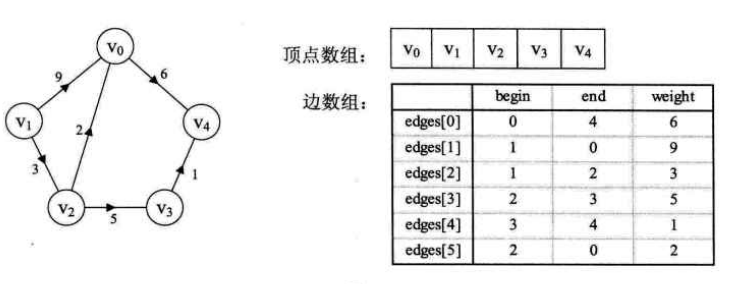

　一、领接矩阵

　　**图的领接矩阵（Adjacency Matrix）存储方式是用两个数组来表示图。一个一位数组存储图中顶点信息，一个二维数组（称为领接矩阵）存储图中的边或弧的信息。**

　　1.举例

- 无向图

　　

 　无向图的领接矩阵的第i行或第i列的非零元素个数正好是第i个顶点的度。

- 有向图

　　

 　有向图的领接矩阵的第i行的非零元素个数正好是第i个顶点的出度，第i列的非零元素个数正好是第i个顶点的入度。

- 带权值的网图

　　

　二、邻接表

　　对于边数相对顶点较少的图，领接矩阵存在对存储空间的极大浪费的。可以考虑对边或弧使用链式存储的方式来避免空间浪费的问题。

　　领接表是由两部分组成。顶点用一个一维数组存储。而每个顶点的所有领接点构成一个线性表，由于领接点的个数不定，所以用单链表存储，无向图称为顶点vi的边表，有向图则称为顶点vi作为弧尾的出边表。

　　**对于有n个顶点和e条边的无向图，其邻接表有n个顶点结点和2e个边结点，而对于有n个顶点和e条弧的有向图，其邻接表有n个顶点结点和e个弧结点。显然，对于稀疏图，邻接表比邻接矩阵节省存储空间。**

　　1.举例说明

- 无向图

　　

 　无向图的邻接表中，顶点vi的度恰好等于该顶点的领接表中边结点的个数

- 有向图

　　

 　有向图中，顶点vi的领接表中边结点的个数仅为该顶点的出度，若要求顶点的入度，则需遍历整个邻接表。有时为了便于求有向图中顶点的入度，可以通过建立一个有向图的逆邻接表得到。逆邻接表就是对图中的每个顶点vi建立一个链接以vi为重点的弧的边表。

- 带权值的网图

　　

　　

　　三、十字链表

　　对于有向图来说，邻接表是有缺陷的。关心了入度问题，想了解入度就必须要遍历整个图才能知道，反之，逆领接表解决了入度却不了解出度的情况。而十字链表可以把它们整合在一起。

　　

　　十字链表的好处就是因为把邻接表和逆邻接表整合在了一起，这样既容易找到以vi为尾的弧，也容易找到以vi为头的弧，因而容易求得顶点的出度和入度。而且，除了结构复杂一点外，创建图算法的时间复杂度和邻接表相同，因此，在有向图的应用中，十字链表是非常好的数据结构模型。

　　四、领接多重表

　　有向图的优化存储可以用十字链表来解决，对于无向图来说，如果更关注边的操作，可以仿照十字链表的方式，对边表结点的结构进行一些改造，即形成邻接多重表。

　　

　　邻接多重表与邻接表的区别，仅仅是在于同一条边在邻接表中用两个结点表示，而在邻接多重表中只有一个结点。这样对边的操作就方便多了。

　　五、边集数组

　　边集数组是由两个一位数组构成。一个是存储顶点的信息；另一个是存储边的信息，这个边数组每个数据元素由一条边的起点下标、终点下标和权组成。显然边集数组关注的是边的集合，在边集数组中要查找一个顶点的度需要扫描整个边数组，效率并不高。因此它更适合对边依次进行处理的操作，而不适合对顶点的相关的操作。

　　