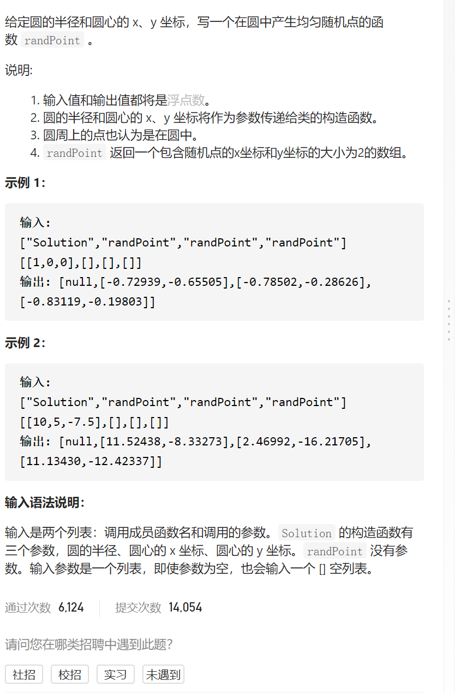
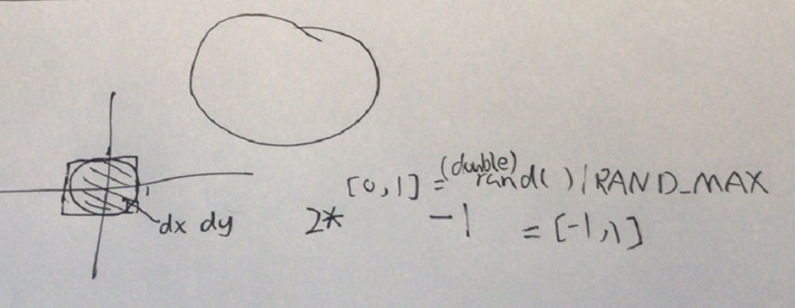

在园内随机生成点



抽象图固定维护寻找



```c
class Solution {
public:
    double r;
    double x;
    double y;
    Solution(double radius, double x_center, double y_center) {
        r=radius,x=x_center,y=y_center;
    }
    
    vector<double> randPoint() {
        while(1){
            double dx=2*(double)rand()/RAND_MAX-1;
            double dy=2*(double)rand()/RAND_MAX-1;
            if(dx*dx+dy*dy<=1)return {dx*r+x,dy*r+y};
        }
    }
};
```

踩过的坑

double dy=2*(double)rand()/RAND_MAX-1;

(double)rand()/RAND_MAX得到[0,1]随机浮点数，不加(double)则==0

