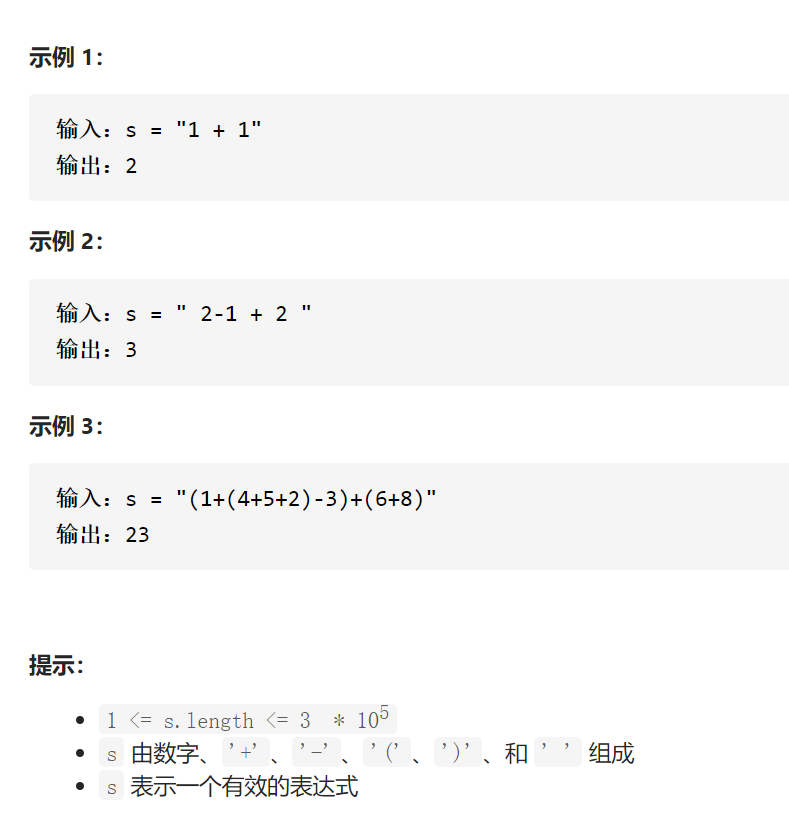

基本计算器



变量简洁正确完整思路

逆波兰表达式1+(2-3*4)/5+6

添加括号 (((1+((2-(3*4))/5))+6)

将符号移动到外一层右边(((1((2(3 4)*)-5)/)+6)+

去掉括号1 2 3 4 * - 5 / + 6 +

处理转化逆波兰表达式

数据栈ans，符号栈flags，遇到从数字压入ans遇到(压入flags遇到)则flags出栈压入ans，直到遇到(，遇到+-*/若flags空压入ans，若flags优先级大于等于则flags出栈压入ans，直到flags空或者优先级低

遇到空格continue遇到数字找准下标放入，遇到+-先把flags所有符号放入ans直到遇到(或者空，然后把+-放入flags，遇到*/先把flag所有符号放入ans直到遇到(+-，然后把*/放入flags，遇到)放入flags，把flag所有符号放入ans直到遇到(或者空，如果flag还有也放到ans

```c
class Solution {
public:
    int calculate(string s) {
        vector<string>vecStr=change(s);
        stack<int>stk;
        for(string &str:vecStr){
            if(isdigit(str[0]))stk.push(stoi(str));
            else {
                int num1=stk.top();stk.pop();
                int num2=0;
                if(!stk.empty()){
                    num2=stk.top();stk.pop();
                }
                if(str=="+")stk.push(num2+num1);
                else if(str=="-")stk.push(num2-num1);
                else if(str=="*")stk.push(num2*num1);
                else if(str=="/")stk.push(num2/num1);
            }
        }
        return stk.top();
    }
    vector<string> change(string &s){
        vector<string>ans;
        stack<char>flags;
        for(int i=0;i<s.size();i++){
            if(isspace(s[i]))continue;
            else if(isdigit(s[i])){
                int preI=i;
                while(isdigit(s[i+1]))i++;
                ans.push_back(string(s.begin()+preI,s.begin()+i+1));
            }
            else if(s[i]=='+'||s[i]=='-'){
                while(!flags.empty()){
                    if(flags.top()=='(')break;
                    ans.push_back(string(1,flags.top()));
                    flags.pop();
                }
                flags.push(s[i]);
            }
            else if(s[i]=='*'||s[i]=='/'){
                while(!flags.empty()){
                    if(flags.top()=='('||flags.top()=='+'||flags.top()=='-')break;
                    ans.push_back(string(1,flags.top()));
                    flags.pop();
                }
                flags.push(s[i]);
            }else if(s[i]=='('){
                flags.push(s[i]);
            }else if(s[i]==')'){
                while(!flags.empty()){
                    if(flags.top()=='('){
                        flags.pop();
                        break;
                    }
                    ans.push_back(string(1,flags.top()));
                    flags.pop();
                }
            }
        }
        while(!flags.empty()){
            ans.push_back(string(1,flags.top()));
            flags.pop();
        }
        return ans;
    }
};
```

