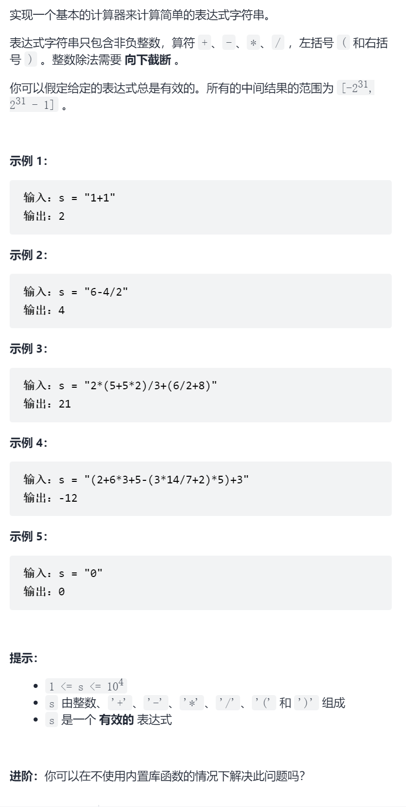
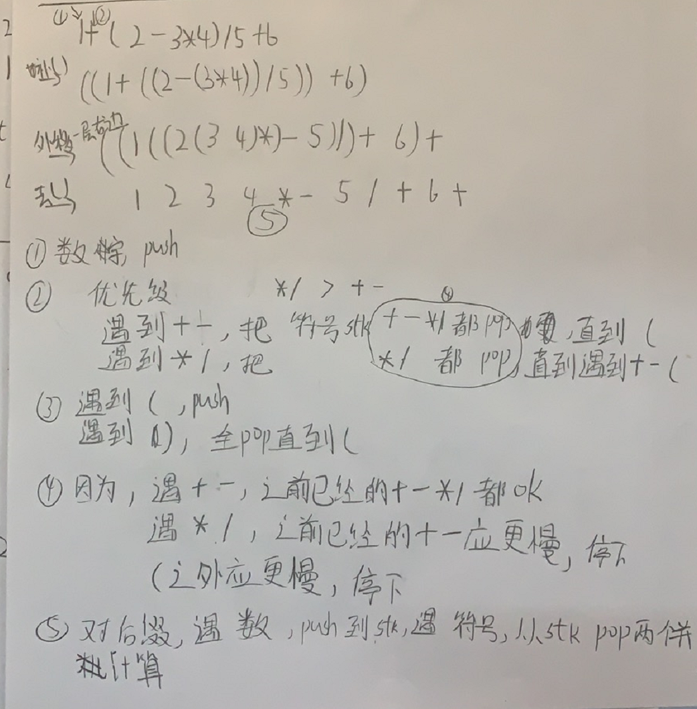

基本计算器III

抽象图一二ij



```c
class Solution {
public:
    int calculate(string s) {
        vector<string>suf=process(s);
        stack<int>nums;
        for(int i=0;i<suf.size();i++){
            if(isdigit(suf[i][0])){
                nums.push(stoi(suf[i]));
            }else {
                int num1=nums.top();nums.pop();
                int num2=nums.top();nums.pop();
                if(suf[i]=="+")nums.push(num2+num1);
                else if(suf[i]=="-")nums.push(num2-num1);
                else if(suf[i]=="*")nums.push(num2*num1);
                else if(suf[i]=="/")nums.push(num2/num1);
            }
        }
        return nums.top();
    }
    vector<string>process(string&s){
        vector<string>ans;
        stack<char>flags;
        int i=0;
        int n=s.size();
        while(i<n){
            if(isdigit(s[i])){
                int j=i;
                i++;
                while(isdigit(s[i]))i++;
                ans.push_back(s.substr(j,i-j));
            }else if(s[i]=='+'||s[i]=='-'){
                while(!flags.empty()&&flags.top()!='('){
                    ans.push_back(string(1,flags.top()));
                    flags.pop();
                }
                flags.push(s[i]);
                i++;
            }else if(s[i]=='*'||s[i]=='/'){
                while(!flags.empty()&&flags.top()!='+'&&flags.top()!='-'&&flags.top()!='('){
                    ans.push_back(string(1,flags.top()));
                    flags.pop();
                }
                flags.push(s[i]);
                i++;
            }else if(s[i]=='('){
                flags.push(s[i]);
                i++;
            }else if(s[i]==')'){
                while(!flags.empty()&&flags.top()!='('){
                    ans.push_back(string(1,flags.top()));
                    flags.pop();
                }
                flags.pop();
                i++;
            }
        }
        while(!flags.empty()){
            ans.push_back(string(1,flags.top()));
            flags.pop();
        }
        return ans;
    }
};
```


踩过的坑

千万不要用to_string(char)会变成ascii数字，用string(1,char)代替