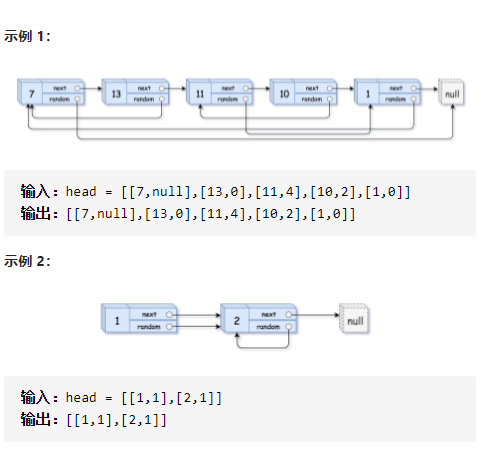
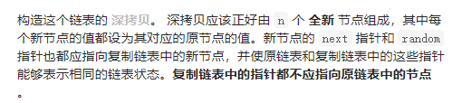

复制带随机指针的链表



遍历简洁正确完整思路

dfs，形参head，得到拷贝的head链表，headClone哈希表存放head链表对应拷贝head链表，if head空边界返回，if headClone有拷贝的head链表提前返回，否则，new head的拷贝节点放进headClone，再dfs求head->next和head->random的拷贝链表，求出来后就得到了拷贝的head链表返回

精确定义

dfs，形参head，得到拷贝的head链表

headClone哈希表存放head链表对应拷贝的head链表

```c
class Solution {
public:
    unordered_map<Node*,Node*>headClone;
    Node* copyRandomList(Node* head) {
        return dfs(head);
    }
    Node*dfs(Node*head){
        if(!head)return nullptr;
        if(headClone[head])return headClone[head];
        Node*clone=new Node(head->val);
        headClone[head]=clone;
        clone->next=dfs(head->next);
        clone->random=dfs(head->random);
        return headClone[head];
    }
};
```

踩过的坑

​    Node*clone=new Node(head);

不需要另外两个参数，因为next和random我需要dfs才能得到他们

拷贝的链表，而不是仅仅借用原来的

如果dfs递归构建的时候，

clone=new Node(head->val,head->next->val,head->random->val

则不是深拷贝

拷贝的head链表生成方法也就是dfs返回值，先new head->val，再dfs(next)dfs(random)

生成拷贝的next链表和拷贝的random链表