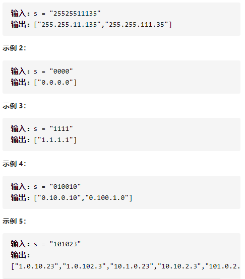

复原IP地址



详细思路

depth是需要处理的端第几个端，如果depth==5说明已经第五段了不用了返回，枚举长度123，从形参的起点beg开始，剪辑，放入，或者不要，剪辑前，如果长度为23且beg为0不能了，剪辑后如果长度为3且大于255也不能，如果beg==s.size()且ans1==4说明刚好可以返回答案，如果beg到了最后且还没4段，或者4段了beg还没最后都return

精确定义

beg开始剪辑的下标

ans1vector保存答案，并在可以时转化为string保存在ans

len长度，剪辑长度

```c
class Solution {
public:
    vector<string> restoreIpAddresses(string s) {
        vector<string>ans;
        vector<string>ans1;
        dfs(0,ans1,ans,s);
        return ans;
    }
    void dfs(int beg,vector<string>&ans1,vector<string>&ans,string s){
        if(beg==s.size()&&ans1.size()==4){
            string str;
            for(auto str1:ans1){
                str+=str1;
                str.push_back('.');
            }
            str.pop_back();
            ans.push_back(str);
            return ;
        }
        if(beg==s.size()||ans1.size()==4)return;
        for(int len=1;len<=3;len++){
            if(beg+len>s.size())return;
            if(s[beg]=='0'&&(len==2||len==3))return;
            string sp=s.substr(beg,len);
            if(len==3&&stoi(sp)>255)return;
            ans1.push_back(sp);
            dfs(beg+len,ans1,ans,s);
            ans1.pop_back();
        }
    }
};
```


踩过的坑

​      if(beg+len>s.size())return;

