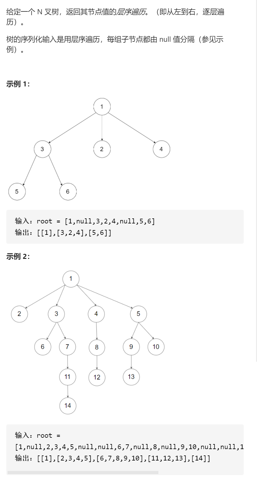
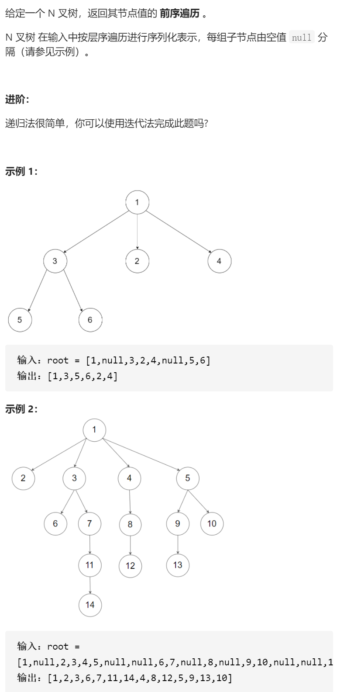
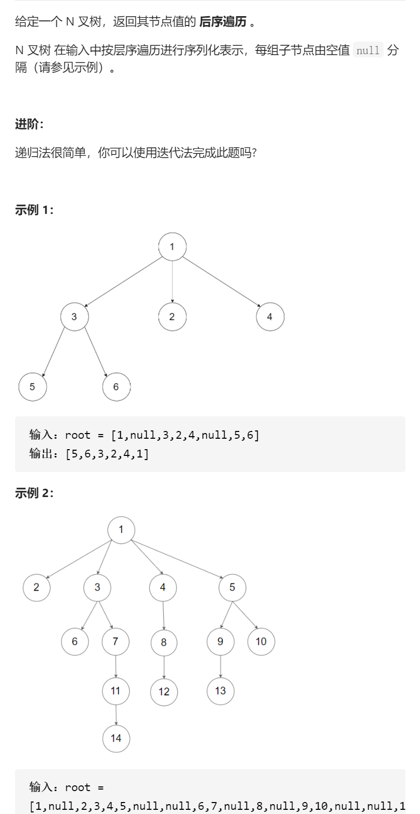

N叉树的层序遍历




遍历简洁正确完整思路

que，拿出一个，放入所有children

```c
class Solution {
public:
    vector<vector<int>> levelOrder(Node* root) {
        queue<Node*>que;
        que.push(root);
        vector<vector<int>>ans;
        while(!que.empty()){
            vector<int>ans1;
            for(int i=que.size();i>0;i--){
                Node*root=que.front();que.pop();
                ans1.push_back(root->val);
                for(Node*curRoot:root->children){
                    que.push(curRoot);
                }
            }
            ans.push_back(ans1);
        }
        return ans;
    }
};
```

N叉树的前序遍历



```c
class Solution {
public:
    vector<int> preorder(Node* root) {
        vector<int>ans;
        stack<Node*>stk;
        if(root)stk.push(root);
        while(!stk.empty()){
            root=stk.top();
            if(root){
                //遇到中，pop中，右左中标记
                stk.pop();
                for(int i=root->children.size()-1;i>=0;i--){
                    stk.push(root->children[i]);
                }
                stk.push(root);
                stk.push(nullptr);
            }else{
                //遇到标记，pop标记处理答案
                stk.pop();
                root=stk.top();stk.pop();
                ans.push_back(root->val);
            }
        }
        return ans;
    }
}
```

N叉树的后序遍历

```c
class Solution {
public:
    vector<int> postorder(Node* root) {
        vector<int>ans;
        stack<Node*>stk;
        if(root)stk.push(root);
        while(!stk.empty()){
            root=stk.top();
            if(root){
                //遇到中，pop中，中标记右左
                stk.pop();
                stk.push(root);
                stk.push(nullptr);
                for(int i=root->children.size()-1;i>=0;i--){
                    stk.push(root->children[i]);
                }
            }else{
                //遇到标记，pop标记处理答案
                stk.pop();
                root=stk.top();stk.pop();
                ans.push_back(root->val);
            }
        }
        return ans;
    }
};
```

