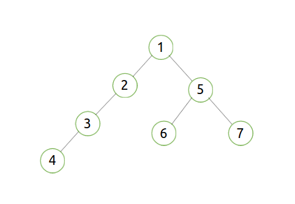
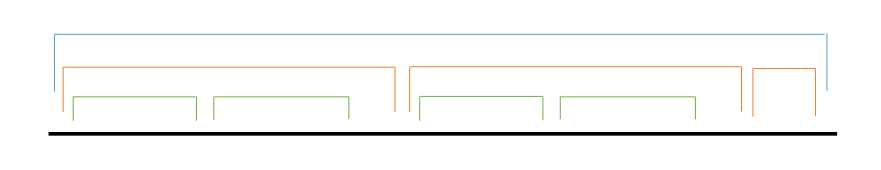

如果允许离线，整个问题可以做到 ![[公式]](image/alpha(n)).svg+xml) 的复杂度。

先考虑这个问题在树上的版本。

（还用这个问题出了一道[胡策](https://www.zhihu.com/search?q=胡策&search_source=Entity&hybrid_search_source=Entity&hybrid_search_extra={"sourceType"%3A"answer"%2C"sourceId"%3A165741734}) HNSDFZ #7 ……捂脸 [【这是题面】](https://link.zhihu.com/?target=https%3A//www.zybuluo.com/ruanxingzhi/note/629182) [【这是题解】](https://link.zhihu.com/?target=https%3A//www.zybuluo.com/ruanxingzhi/note/632596)）

先说结论：**树上多个点的LCA，就是DFS序最小的和DFS序最大的这两个点的LCA。**

例如，在下图的树中，(2,4,6,7)的LCA就是(2,7)的LCA。

\-----------------------------------------------------------------------------------------------------------------------

以下是这一命题的证明：

DFS序只存在包含的关系，不存在相交的关系。如下图所示。

假设有三个点，DFS序分别为a,p,b且a<p<b。那么我们断言LCA(a,p,b)=LCA(a,b)。

这是因为：两个点的LCA，就是最近的同时包含它们的那个区间所代表的点。既然LCA(a,b)的区间包含了a和b，那也一定包含了位于a和b之间的p。

因此，对于每任意三个点，只需要保存DFS序最大和最小的点。这个点集的LCA，也就是整个[点集DF](https://www.zhihu.com/search?q=点集DF&search_source=Entity&hybrid_search_source=Entity&hybrid_search_extra={"sourceType"%3A"answer"%2C"sourceId"%3A165741734})S序最小的和DFS序最大的这两个点的LCA。

\-----------------------------------------------------------------------------------------------------------------------

既然知道了这个结论那就很好办了。

询问一大堆点的LCA，其实就是询问两个点的LCA，随便写个什么东西问题就解决了。

如果允许离线的话可以做到 ![[公式]](image/approx+O(n).svg+xml) 。

**那么现在如何应用到DAG上？**

一位匿名用户给出了做法：建立这个DAG的支配树，然后DAG上的LCA就被转化成了树上的LCA。于是就可以用上面的算法解决问题。