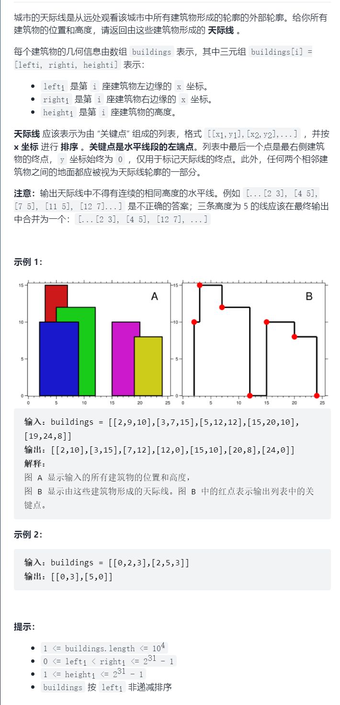

天际线问题



```c
抽象图一二ij
线段树
#define mid (left+right>>1)
#define ll(x) (x<<1)
#define rr(x) (x<<1|1)
const int N=1e9;

int w[N+10];
int sum[N+10];
int lazy[N+10];
//节点，节点左端点，节点右端点
void build(int root,int left,int right){
    //叶子节点，点权为区间和
    if(left==right){
        sum[root]=w[left];
        return ;
    }
    build(ll(root),left,mid);
    build(rr(root),mid+1,right);
    //回溯收集区间和
    sum[root]=sum[ll(root)]+sum[rr(root)];
}
void pushdown(int root,int left,int right){
    //子树加上标记值
    sum[ll(root)]+=lazy[root]*(mid-left+1);
    sum[rr(root)]+=lazy[root]*(right-mid);
    //标记下移 
    lazy[ll(root)]+=lazy[root];
    lazy[rr(root)]+=lazy[root];
    lazy[root]=0;
}
//节点，节点左端点，节点右端点，区间左端点，区间右端点，目标值
void update(int root,int left,int right,int l,int r,int val){
    //节点包含于待修改的区间
    if(l<=left&&right<=r){
        //标记并修改该节点值
        lazy[root]+=val;
        sum[root]+=val*(right-left+1);
        return;
    }
    //标记下移
    if(lazy[root])pushdown(root,left,right);
    if(l<=mid)update(ll(root),left,mid,l,r,val);
    if(mid<r)update(rr(root),mid+1,right,l,r,val);
    //回溯收集区间和
    sum[root]=sum[ll(root)]+sum[rr(root)];
}
//节点，节点左端点，节点右端点，区间左端点，区间右端点
int query(int root,int left,int right,int l,int r){
    if(l<=left&&right<=r)return sum[root];
    if(r<left||right<l)return 0;
    //标记下移
    if(lazy[root])pushdown(root,left,right);
    //回溯收集区间和
    return query(ll(root),left,mid,l,r)+query(rr(root),mid+1,right,l,r);
}
```

