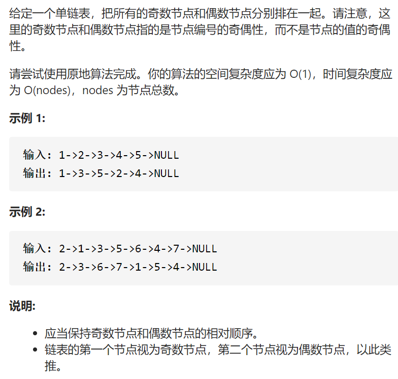
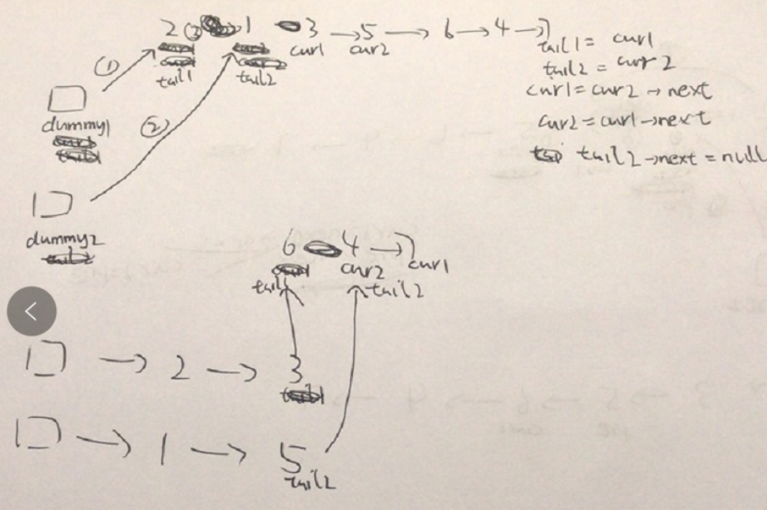

奇偶链表



变量简洁正确完整思路

链表画图，结尾觉得cur溢出就暴力nullptr，



```c
class Solution {
public:
    ListNode* oddEvenList(ListNode* head) {
        if(!head)return nullptr;
        ListNode*dummy1=new ListNode(-1,head);
        ListNode*dummy2=new ListNode(-1,head->next);
        ListNode*tail1=dummy1,*tail2=dummy2,*cur1=head,*cur2=head->next;
        while(cur1&&cur2){
            tail1->next=cur1;
            tail2->next=cur2;
            cur1->next=nullptr;
            tail1=cur1;
            tail2=cur2;
            if(cur2->next)cur1=cur2->next;
            else cur1=nullptr;
            if(cur1&&cur1->next)cur2=cur1->next;
            else cur2=nullptr;
            tail2->next=nullptr;
        }
        if(cur1){
            tail1->next=cur1;
            tail1=cur1;
        }
        if(cur2){
            tail2->next=cur2;
            tail2=cur2;
        }
        tail1->next=dummy2->next;
        return dummy1->next;
    }
};

```

