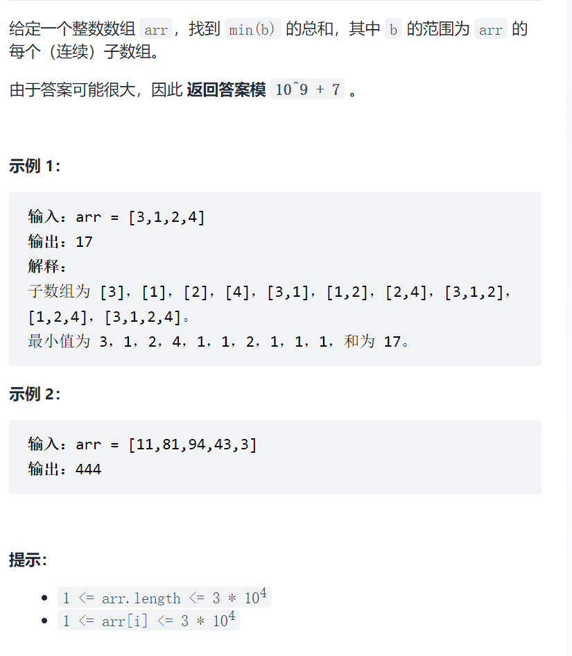
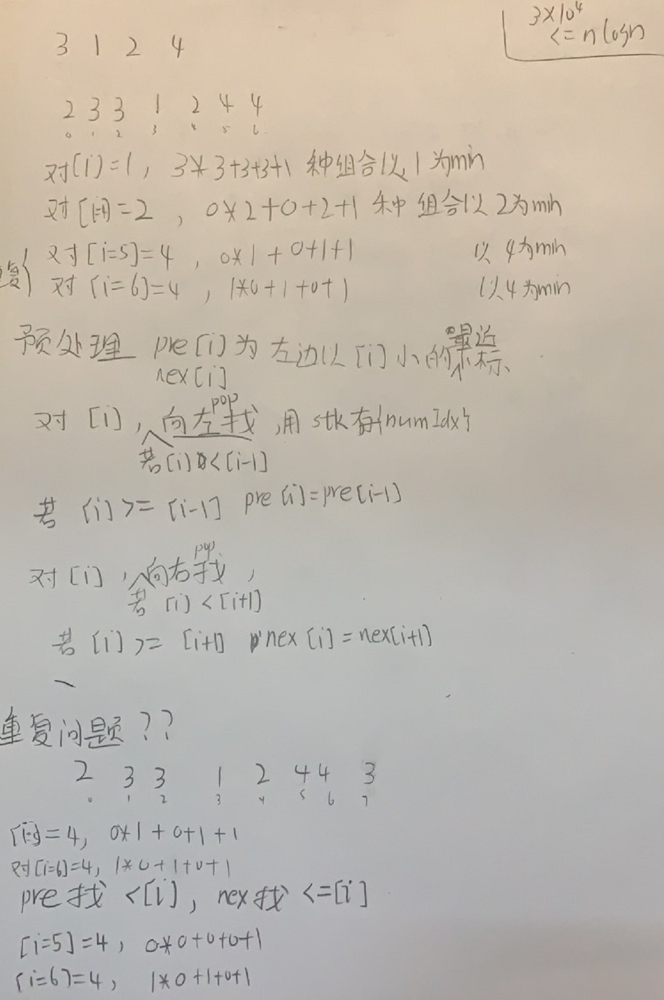

子数组的最小值之和



抽象图一二ij



```c
class Solution {
public:
    int sumSubarrayMins(vector<int>& arr) {
        const int mod=1e9+7;
        stack<int>stk;
        int n=arr.size();
        vector<int>pre(n);
        for(int i=0;i<n;i++){
            while(!stk.empty()&&arr[stk.top()]>=arr[i])stk.pop();
            if(stk.empty())pre[i]=-1;
            else pre[i]=stk.top();
            stk.push(i);
        }
        vector<int>nex(n);
        while(!stk.empty())stk.pop();
        for(int i=n-1;i>=0;i--){
            while(!stk.empty()&&arr[stk.top()]>arr[i])stk.pop();
            if(stk.empty())nex[i]=n;
            else nex[i]=stk.top();
            stk.push(i);
        }
        long ans=0;
        for(int i=0;i<n;i++){
            long leftCnt=i-pre[i]-1;
            long rightCnt=nex[i]-i-1;
            ans=(ans+arr[i]*(leftCnt*rightCnt+leftCnt+rightCnt+1))%mod;
        }
        return ans;
    }
};
```

