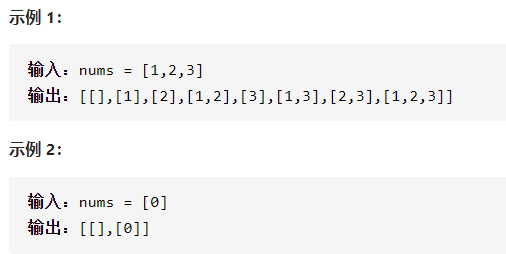
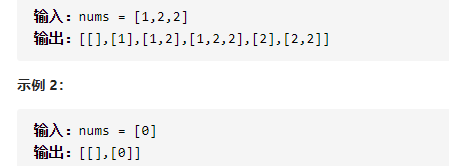

子集

详细思路

枚举每个数，要这个数，或者不要这个数，每一次都要放进ans，如果到了最大的，要了后就返回，begin+1防止只是交换和重复拿一个数

精确定义

begin

```c
class Solution {
public:
    vector<vector<int>> subsets(vector<int>& nums) {
        vector<vector<int>>ans;
        vector<int>ans1;
        dfs(0,ans,ans1,nums);
        return ans;
    }
    void dfs(int begin,vector<vector<int>>&ans,vector<int>&ans1,vector<int>&nums){
        ans.push_back(ans1);
        if(ans1.size()==nums.size())return ;
        for(int i=begin;i<nums.size();i++){
            ans1.push_back(nums[i]);
            dfs(i+1,ans,ans1,nums);
            ans1.pop_back();
        }
    }
};
```

踩过的坑

​      dfs(i+1,ans,ans1,nums);

begin从i+1开始，只能向右

------

子集II



详细思路

sort，每次都要存放答案，向右找，枚举，放进去，或者不要，if(!vis[i-1]&&i i-1)防止同一个数，begin向右找防止只是交换

精确定义

depth需要判断

i需要判断

begin起点

```c
class Solution {
public:
    vector<vector<int>> subsetsWithDup(vector<int>& nums) {
        int n=nums.size();
        sort(nums.begin(),nums.end());
        vector<vector<int>>ans;
        vector<int>ans1;
        vector<int>vis(n,0);
        dfs(0,0,ans,ans1,nums,vis);
        return ans;
    }
    void dfs(int depth,int begin,vector<vector<int>>&ans,vector<int>&ans1,vector<int>&nums,vector<int>&vis){
        ans.push_back(ans1);
        if(depth==nums.size())return;
        for(int i=begin;i<nums.size();i++){
            if(i-1>=0&&!vis[i-1]&&nums[i]==nums[i-1])continue;
            ans1.push_back(nums[i]);
            vis[i]=1;
            dfs(depth+1,i+1,ans,ans1,nums,vis);
            vis[i]=0;
            ans1.pop_back();
        }
    }
};


```


