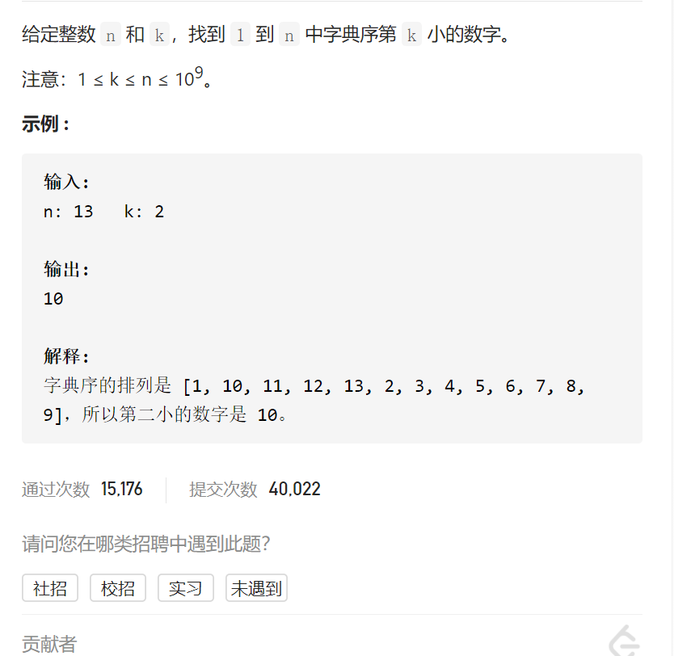
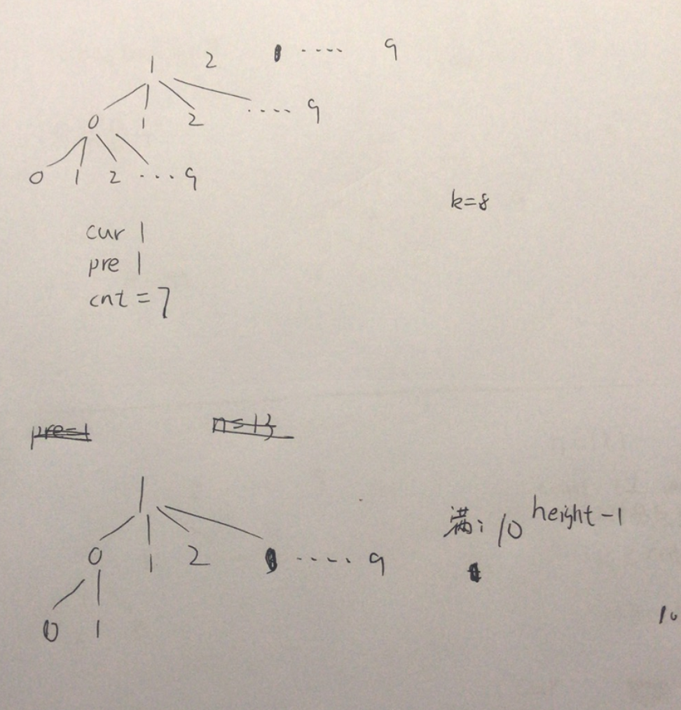

字典序的第K小数字



变量简洁正确完整思路

抽象成树，按字典序排序就是前序遍历顺序，初始状态 cur=1是已经来到的位置，要走到cur=k，初始状态pre=1是前缀，计算出pre树有多少个节点（不超过n），cnt=getCnt(pre)，cnt=7但是k=8则pre树跳过，cur+=cnt，pre++，cur=9而k=8则cur++，pre*=10进入下一层，先写框架



```c
class Solution {
public:
    int findKthNumber(int n, wint k) {
        int cur=1,pre=1;
        while(cur<k){
            int cnt=getCnt(pre,n);
            if(cnt<=k){
                cur++;
                pre*=10;
            }else if(cnt>k){
                cur+=cnt;
                pre++;
            }
        }
        return pre;
    }
    int getCnt(int pre,int n){
        
    }
};
```


完全十叉树的节点树（对比完全二叉树的节点数）

getCnt，只要1+左+右，但是满二叉树可以10^(height-1)，利用leftright同时左右，

等到leftright同时为空则是满二叉树，而完全十叉树只要1+十个儿子，也可以利用

第一个儿子和第10个儿子来

```c
class Solution {
public:
    int findKthNumber(int n, int k) {
        int cur=1,pre=1;
        while(cur<k){
            int cnt=getCnt(pre,n);
            if(cnt<=k){
                cur++;
                pre*=10;
            }else if(cnt>k){
                cur+=cnt;
                pre++;
            }
        }
        return pre;
    }
    int getCnt(int pre,int n){
        if(pre>n)return 0;

        int height=1;
        int one=pre*10,ten=pre*10+9;
        while(one<=n&&ten<=n){
            height++;
            one=one*10;
            ten=ten*10+9;
        }
        if(one>n)return pow(height,10)-1;

        int ans=0;
        for(int i=0;i<10;i++){
            ans+=getCnt(pre*10+i,n);
        }
        return ans+1;
    }
};
```


debug，采用完全二叉树的方法失败，改用技巧

```c
class Solution {
public:
    int findKthNumber(int n, int k) {
        int cur=1,pre=1;
        while(cur<k){
            int cnt=getCnt(pre,n);
            //cout<<cur<<' '<<pre<<' '<<cnt<<endl;
            if(cur+cnt==k){
                return pre+1;
            }
            else if(cur+cnt<k){
                cur+=cnt;
                pre++;
            }else if(cur+cnt>k){
                cur++;
                pre*=10;
            }
        }
        return pre;
    }

    long long getCnt(long long pre, long long n) {
        long long ans = 0, nex = pre + 1;
        while (pre <= n) {
            ans += min(n + 1, nex) - pre;
            pre *= 10;
            nex *= 10;
        }
        return ans;
    }
/*
        int getCnt(int pre,int n){
        if(pre>n)return 0;
        if(pre*10>n)return 1;
        

        int height=1;
        int one=pre*10,ten=pre*10+9;
        while(one<=n&&ten<=n){
            height++;
            one=one*10;
            ten=ten*10+9;
        }
        if(one>n)return pow(10,height-1)+1;

        int ans=0;
        for(int i=0;i<10;i++){
            ans+=getCnt(pre*10+i,n);
        }
        return ans+1;
    }
*/
};

```

