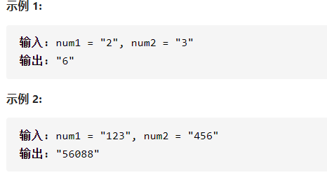

字符串相乘



详细思路

创建一个数组ans用于保存计算结果，从右往左遍历ij，把num1[i]*num2[j]结果放到ans[i+j+1]，这样最高位num1[0]*num2[0]放到ans[1]，ans[0]放进位，最低位num1[n-1]*num2[m-1]放ans[n+m-1]，ans需要n+m长度。计算完，需要对ans处理进位，从右往左，余数原地，/10留给下一位，最后把数组遍历变成字符串

精确定义

```c

class Solution {
public:
    string multiply(string num1, string num2) {
        int n=num1.size(),m=num2.size();
        if(num1=="0"||num2=="0")return "0";
        vector<int>ans(m+n);
        for(int i=n-1;i>=0;i--){
            for(int j=m-1;j>=0;j--){
                ans[i+j+1]+=(num1[i]-'0')*(num2[j]-'0');
            }
        }
        for(int i=n+m-1;i>=1;i--){
            ans[i-1]+=ans[i]/10;
            ans[i]%=10;
        }
        string ansStr=(ans[0]==0?"":to_string(ans[0]));
        for(int i=1;i<n+m;i++){
            ansStr+=ans[i]+'0';
        }
        return ansStr;
    }
};

```


踩过的坑

int->string：ans=to_string(int)

string+=int：string+=int+'0'

char->int：num1[i]-'0'