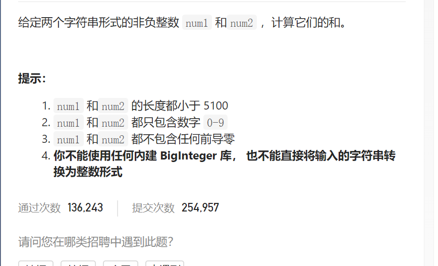

字符串相加



```c
class Solution {
public:
    string addStrings(string num1, string num2) {
        int carry=0;
        string ans;
        while(!num1.empty()||!num2.empty()){
            int a=0,b=0;
            if(!num1.empty()){
                a=num1.back()-'0';
                num1.pop_back();
            }
            if(!num2.empty()){
                b=num2.back()-'0';
                num2.pop_back();
            }
            int add=a+b+carry;
            //cout<<add<<endl;
            ans.push_back(add%10+'0');
            carry=add/10;
        }
        if(carry==1)ans.push_back('1');
        reverse(ans.begin(),ans.end());
        return ans;
    }
};

```


踩过的坑

​      ans.push_back(add%10+'0');

int自动转化为char或者char自动转化为int只会根据ascii，而不是原本的值