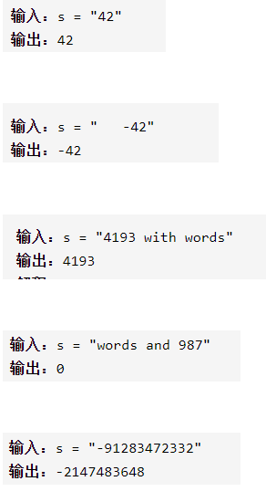

字符串转换整数atoi



详细思路

建立状态转移图和状态转换表，哈希表存储状态转移表的行索引和内容，对于每个字符，转换成状态转移表的列索引，通过哈希表找到新的状态，当状态是signed并且来了-记录正负，当状态是in_number并且来了数字把数字放到答案最低位

精确定义

state是当前状态

table是状态转移表的行索引对应内容

positive是当前计算结果的绝对值

c是当前字符

isPositive是正数标志

```c
class Solution {
public:
    int myAtoi(string str) {
        for (char c : str)change(c);
        if(isPositive)return positive;
        else return -positive;
    }
    void change(char c) {
        state = table[state][getCol(c)];
        if (state == "in_number") {
            positive = positive * 10 + c - '0';
            positive = isPositive? min(positive, (long long)INT_MAX) : min(positive, -(long long)INT_MIN);
        }
        else if (state == "signed"&&c=='-')isPositive=false;
    }
    int getCol(char c) {
        if (isspace(c)) return 0;
        if (c == '+' || c == '-') return 1;
        if (isdigit(c)) return 2;
        return 3;
    }
private:
    string state = "start";
    int isPositive = 1;
    long long positive = 0;
    unordered_map<string, vector<string>> table = {
        {"start", {"start", "signed", "in_number", "end"}},
        {"signed", {"end", "end", "in_number", "end"}},
        {"in_number", {"end", "end", "in_number", "end"}},
        {"end", {"end", "end", "end", "end"}}
    };
};

```


踩过的坑

  long long positive = 0;

  positive = isPositive? min(positive, (long long)INT_MAX) : min(positive, -(lon

  else if (state == "signed"&&c=='-')isPositive=false;