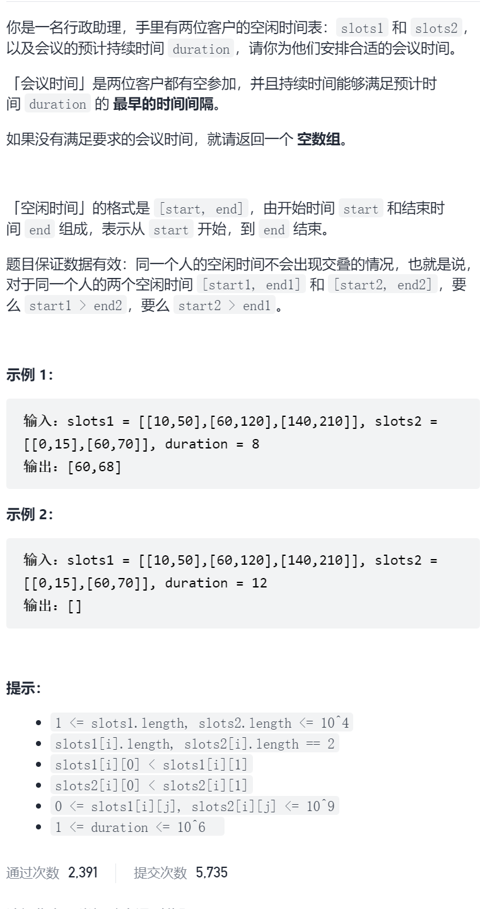

安排会议日程




安排会议日程


```c
class Solution {
public:
    vector<int> minAvailableDuration(vector<vector<int>>& slots1, vector<vector<int>>& slots2, int duration) {
        sort(slots1.begin(),slots1.end());
        sort(slots2.begin(),slots2.end());
        int p1=0,p2=0;
        int n=slots1.size(),m=slots2.size();
        while(p1<n&&p2<m){
            int s1=slots1[p1][0],e1=slots1[p1][1],s2=slots2[p2][0],e2=slots2[p2][1];
            int maxS=max(s1,s2),minE=min(e1,e2);
            if(maxS<minE){
                if(minE-maxS>=duration)return {maxS,maxS+duration};
            }
            if(e1<e2)p1++;
            else p2++;
        }
        return {};
    }
};
```


