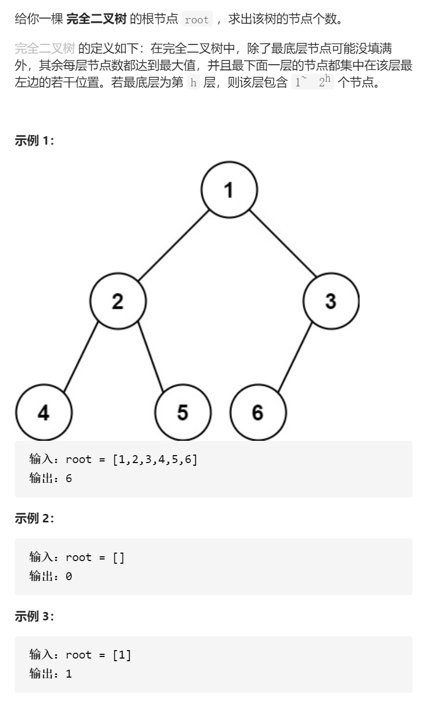

完全二叉树的节点个数



变量简洁正确完整思路

dfs，形参root，计算出完全二叉树root的节点数，只要算出左右子树的节点数，+1就行了，空节点提前返回0，但是对于root树，root最后一层的最后一个root存在，则可以利用公式return 1<<height-1，因此对于root树是满的应利用公式，判断方法是left

=left->left，right=right->right，height++，判断leftright同时为空

```c
class Solution {
public:
    int countNodes(TreeNode* root) {
        return dfs(root);
    }
    int dfs(TreeNode*root){
        if(!root)return 0;  
        int height=1;
        TreeNode*left=root->left,*right=root->right;
        while(left&&right){
            height++;
            left=left->left;
            right=right->right;
        }
        if(!left)return (1<<height)-1;
        return 1+dfs(root->left)+dfs(root->right);
    }
};

```


踩过的坑

1<<n  是2^n   2<<n  是2*2^n