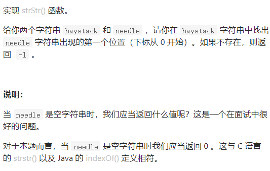
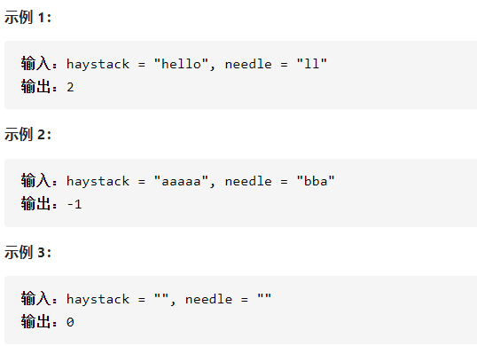

实现strStr





详细思路

对于字符串每一个起点i，都cur1cur2同时遍历，如果不同退出起点++，如果相同到头就返回i

精确定义

i需要检查的起点

cur1第一个字符串需要检查的点

cur2第二个字符串需要检查的点

```c
class Solution {
public:
    int strStr(string haystack, string needle) {
        if(needle.size()==0)return 0;
        if(haystack.size()==0)return -1;
        for(int i=0;i<haystack.size();i++){
            int cur1=i,cur2=0;
            while(1){
                if(haystack[cur1]!=needle[cur2])break;
                cur1++,cur2++;
                if(cur2==needle.size())return i;
            }
        }
        return -1;
    }
};

```


详细思路

kmp，getNext找出前缀表，前缀表就是前i个数，前缀和正序后缀相同时前缀的最大长度如aabaaf前缀表是010120 

a s s a a s s a a s a 

0 0 0 11 23 4 5 61  6是因为assaas=assaas正序后缀 1是因为a=a

，j是最长相同前缀后缀长度，对于第i个字符，找到0到i之间的j，赋值next

举例子

aabaaf

一开始next0=0 j=0 

i从1开始，如果j>0且s[i]!=s[j]j回溯到nextj-1，这个i是不可以增加前后缀长度的，j回到上一个可以的状态，如果si=sj则j++这个i是可以增加相同前后缀长度的，nexti更新为j，

弄好next前缀表后，遍历文本串，如果相同i++j++，如果不同如aabaabaafc  aabaaf

匹配到bf，不相同了，j=5，next4=2，最长前缀后缀长度为2，从j=2开始匹配b = b，一旦j==needle.size()立刻返回

```c
class Solution {
public:
    void getNext(int* next, const string& s) {
        int j = 0;
        next[0] = 0;
        for(int i = 1; i < s.size(); i++) {
            while (j > 0 && s[i] != s[j]) {
                j = next[j - 1];
            }
            if (s[i] == s[j]) {
                j++;
            }
            next[i] = j;
        }
    }
    int strStr(string haystack, string needle) {
        if (needle.size() == 0) {
            return 0;
        }
        int next[needle.size()];
        getNext(next, needle);
        int j = 0;
        for (int i = 0; i < haystack.size(); i++) {
            while(j > 0 && haystack[i] != needle[j]) {
                j = next[j - 1];
            }
            if (haystack[i] == needle[j]) {
                j++;
            }
            if (j == needle.size() ) {
                return (i - needle.size() + 1);
            }
        }
        return -1;
    }
};
```


