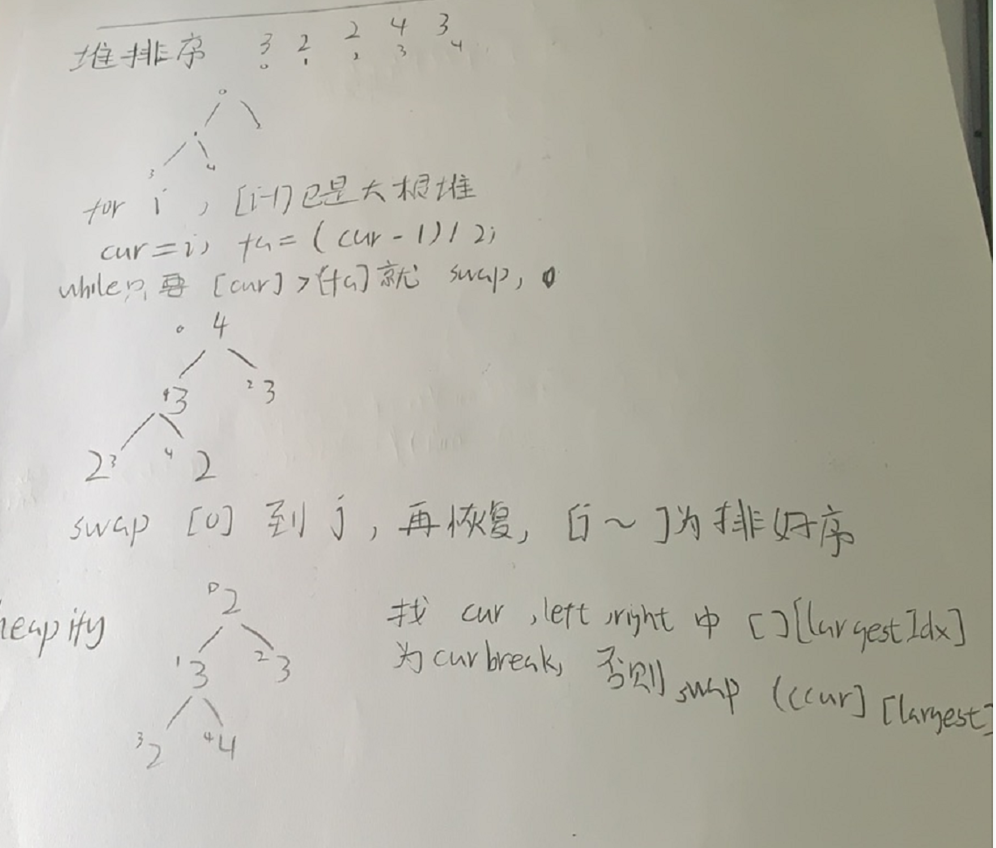
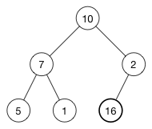
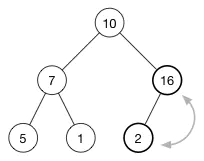
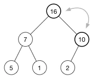
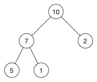
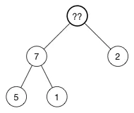
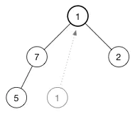
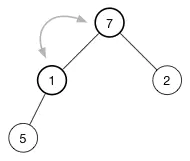
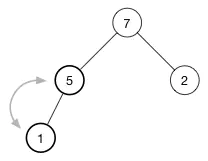

先看看堆排序，通过

```c
class Solution {
public:
    vector<int> sortArray(vector<int>& nums) {
        int n=nums.size();
        for(int i=0;i<n;i++){
            int cur=i;
            int fa=(cur-1)/2;
            while(nums[cur]>nums[fa]){
                swap(nums[cur],nums[fa]);
                cur=fa;
                fa=(cur-1)/2;
            }
        }
        for(int j=n-1;j>=0;j--){
            swap(nums[0],nums[j]);
            heapify(nums,0,j);
        }
        return nums;
    }
    void heapify(vector<int>&nums,int cur,int n){
        int left=cur*2+1,right=cur*2+2;
        while(left<n){
            int largestIdx=cur;
            if(left<n&&nums[left]>nums[largestIdx])largestIdx=left;
            if(right<n&&nums[right]>nums[largestIdx])largestIdx=right;
            if(largestIdx==cur)break;
            swap(nums[cur],nums[largestIdx]);
            cur=largestIdx;
            left=cur*2+1,right=cur*2+2;
        }
    }
};
```


# 堆的插入：

每次插入都是将先将新数据放在数组最后，由于从这个新数据的父结点到根结点必然为一个有序的序列，现在的任务是将这个新数据插入到这个有序序列中——这就类似于直接插入排序中将一个数据并入到有序区间中。

我们通过一个插入例子来看看插入操作的细节。我们将数字 `16` 插入到这个堆中：


堆的数组是： `[ 10, 7, 2, 5, 1 ]`。

第一步是将新的元素插入到数组的尾部，数组变成：[ 10, 7, 2, 5, 1, 16 ]；

相应的树变成了：



`16` 被添加最后一行的第一个空位。

不行的是，现在堆属性不满足，因为 `2` 在 `16` 的上面，我们需要将大的数字在上面（这是一个最大堆）

为了恢复堆属性，我们需要交换 `16` 和 `2`。



现在还没有完成，因为 `10` 也比 `16` 小。我们继续交换我们的插入元素和它的父节点，直到它的父节点比它大或者我们到达树的顶部。这就是所谓的 **shift-up**，每一次插入操作后都需要进行。它将一个太大或者太小的数字“浮起”到树的顶部。

最后我们得到的堆：



现在每一个父节点都比它的子节点大。

```c

void MaxHeapInsert (MaxHeap &H, EType &x)
{
	if(H.HeapSize == H.MaxSize)
		return false;
	int i = ++H.HeapSize;
	while(i!=1 && x>H.heap[i/2])
	{
		H.heap[i] = H.heap[i/2];
		i = i/2;
	}
	H.heap[i] = x;
	return true;
}

```


# 堆的删除：

堆中每次都只能删除堆顶元素。为了便于重建堆，实际的操作是将最后一个数据的值赋给根结点，然后再从根结点开始进行一次从上向下的调整。调整时先在左右子结点中找最小的，如果父结点比这个最小的子结点还小说明不需要调整了，反之将父结点和它交换后再考虑后面的结点。相当于根结点数据的“下沉”过程。

我们将这个树中的 `(10)` 删除：



现在顶部有一个空的节点，怎么处理？



当插入节点的时候，我们将新的值返给数组的尾部。现在我们来做相反的事情：我们取出数组中的最后一个元素，将它放到树的顶部，然后再修复堆属性。



现在来看怎么 **shift-down** `(1)`。为了保持最大堆的堆属性，我们需要树的顶部是最大的数据。现在有两个数字可用于交换 `7` 和 `2`。我们选择这两者中的较大者称为最大值放在树的顶部，所以交换 `7` 和 `1`，现在树变成了：



继续堆化直到该节点没有任何子节点或者它比两个子节点都要大为止。对于我们的堆，我们只需要再有一次交换就恢复了堆属性：



```c

void MaxHeapDelete (MaxHeap &H, EType &x)
{
	if(H.HeapSize == 0)
		return false;
	x = H.heap[1];
	H.heap[0] = H.heap[H.HeapSize--];
	int i = 1, son = i*2+1; 
 
	while(son <= H.HeapSize)
	{
		if(son <= H.HeapSize && H.heap[0] < H.heap[son+1])
			son++;
		if(H.heap[0] >= H.heap[son])
			break;
		H.heap[i] = H.heap[son];
		i = son;
		son  = son*2+;
	}
	H.heap[i] = H.heap[0];
	return true;
}

```

