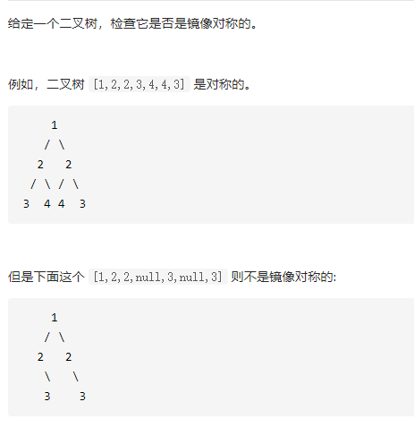

对称二叉树

答案

详细思路dfs，判断root1root2两棵树是否为镜像
精确定义dfs，树root1和数roo2是否为镜像，如果都是空true，如果一个空false，如果val不同是false，否则判断树roo1->left和树root2->right是否镜像，也要判断树root1->right和树root2->left是否为镜像

```c
class Solution {
public:
    bool isSymmetric(TreeNode* root) {
        if(!root)return false;
        return dfs(root->left,root->right);
    }
    bool dfs(TreeNode*root1,TreeNode*root2){
        if(!root1&&!root2)return true;
        if(!root1||!root2)return false;
        if(root1->val!=root2->val)return false;
        return dfs(root1->left,root2->right)&&dfs(root1->right,root2->left);
    }
};

```

踩过的坑定义有些别扭，判断两棵树是否为镜像，需要判断子树是内侧子树和外侧子树
详细思路层序遍历，pop更新答案push左右，两次，第一次的left对应第二次的right，第一次的right对应第二次的

```c
class Solution {
public:
    bool isSymmetric(TreeNode* root) {
        queue<TreeNode*>que;
        que.push(root);
        que.push(root);
        while(!que.empty()){
            //pop更新答案push左右
            TreeNode*tmp1=que.front();
            que.pop();
            TreeNode*tmp2=que.front();
            que.pop();
            
            if(!tmp1&&!tmp2)continue;
            if(!tmp1||!tmp2)return false;
            if(tmp1->val!=tmp2->val)return false;

            que.push(tmp1->left);
            que.push(tmp2->right);
            que.push(tmp1->right);
            que.push(tmp2->left);
        }
        return true;
    }
};
```

踩过的坑能递归就递归