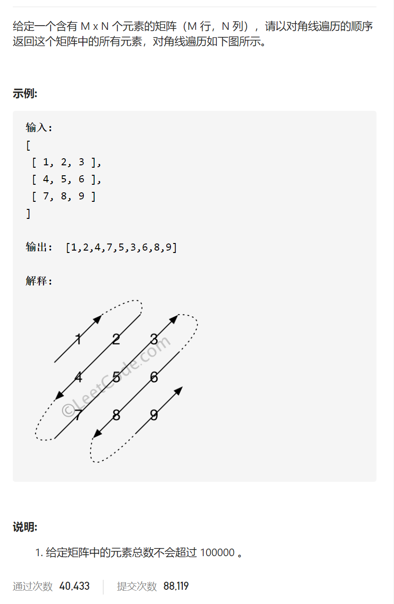
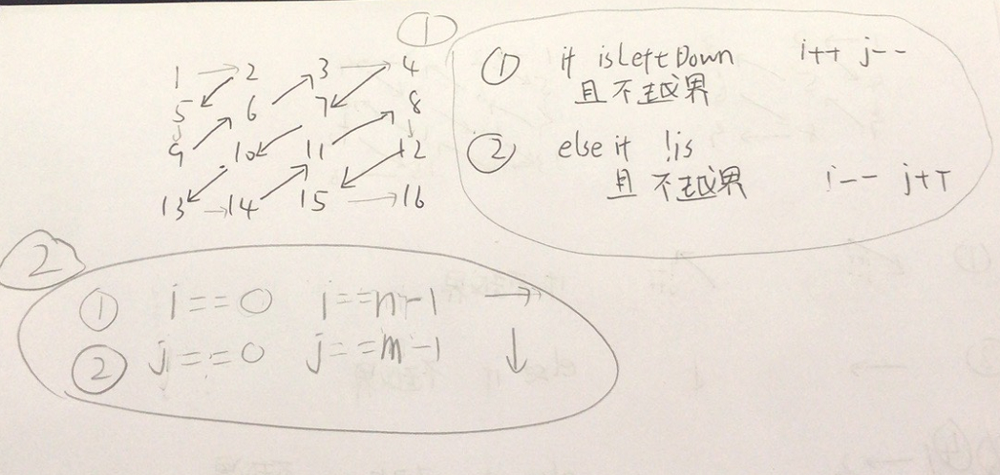

对角线遍历



抽象图固定维护寻找



先思考逻辑块1↙或者↗，再思考逻辑块2←或者→

再思考逻辑块1与逻辑块2之间的逻辑，显然是逻辑块1都不行就进行逻辑块2

```c
class Solution {
public:
    vector<int> findDiagonalOrder(vector<vector<int>>& mat) {
        int n=mat.size(),m=mat[0].size();
        int i=0,j=0;
        vector<int>ans;
        bool isLeftDown=false;
        for(int k=0;k<m*n;k++){
            //cout<<i<<' '<<j<<' '<<endl;
            ans.push_back(mat[i][j]);
            if(isLeftDown&&i+1<n&&j-1>=0){
                i++,j--;
            }else if(!isLeftDown&&i-1>=0&&j+1<m){
                i--,j++;
            }else {
                if((i==0||i==n-1)&&j+1<m){
                    j++;
                }else if((j==0||j==m-1)&&i+1<n){
                    i++;
                }
                isLeftDown=!isLeftDown;
            }
        }
        return ans;
    }
};
```


