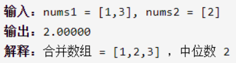
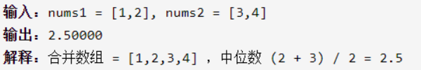
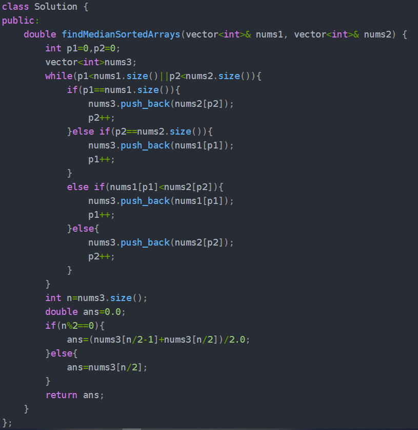
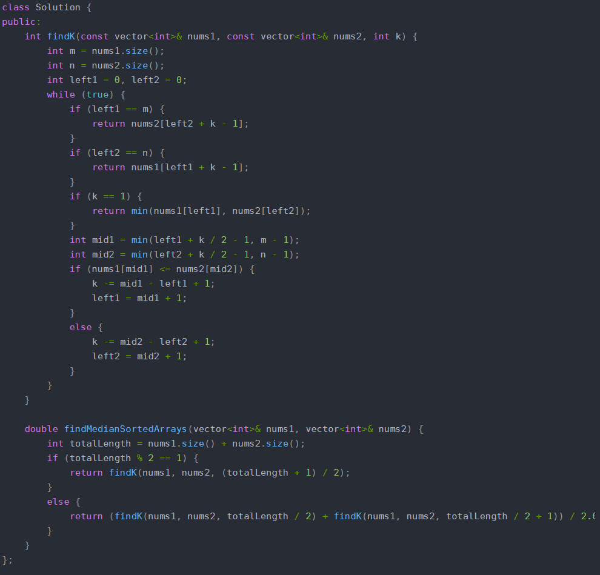

寻找两个正序数组的中位数

详细思路

同时遍历两个数组，较小的作为新数组节点并移到下一个节点，当较短的结束不断取另一个数组节点并移动到下一个节点，新数组取中位数

精确定义

p1第一个数组当前比较的元素下标

p2第二个数组当前比较的元素下标

nums3合并后的数组

详细思路

找到第k小的整数，在left和k之间找到mid=left+k/2-1；两个数组的mid中较小的一个，它的left可以直接跳跃到mid+1，相当于这个数组缩短了，相当于在缩短的数组中寻找第k-(mid-left+1)小的数，当一个数组缩短为空时直接从另一个数组找第k小的数，或者k==1时找两个数组的最小数

精确的定义

left1第一个数组的最左边元素

left2第二个数组的最左边元素

mid1第一个数组可以尝试抛弃的最后一个元素

mid2第二个数组可以尝试抛弃的最后一个元素

k两个数组合起来的第k小的数

