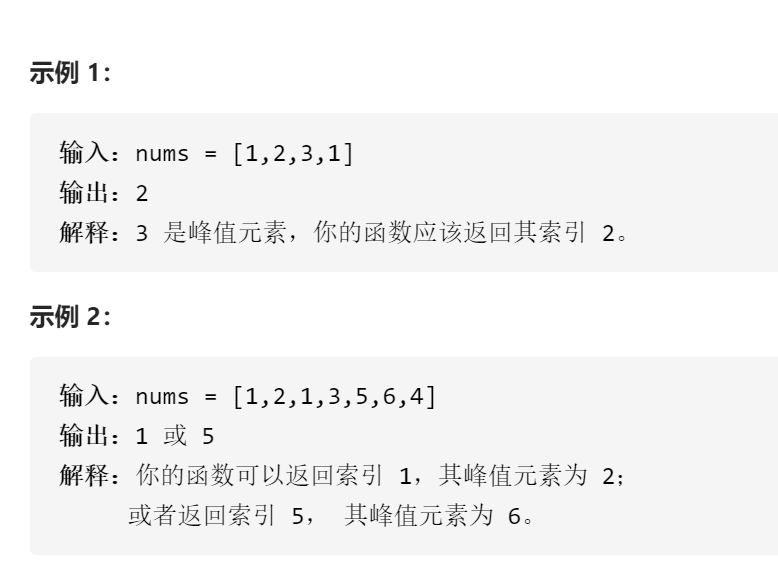

寻找峰值



变量简洁正确完整思路

二分，leftrightmid，如果[mid]<[mid+1]则mid右边必有峰值，去右边，如果[mid]>[mid+1]则mid左边必有峰值去左边，如果mid==left1个2个元素，输出较大、

```c
class Solution {
public:
    int findPeakElement(vector<int>& nums) {
        int n=nums.size();
        int left=0,right=n-1;
        while(left<=right){
            int mid=left+(right-left)/2;
            if(left==mid){
                if(right==mid)return mid;
                else return nums[mid]>nums[right]?mid:right;
            }else if(nums[mid]<nums[mid+1]){
                left=mid+1;
            }else if(nums[mid]>nums[mid+1]){
                right=mid;
            }
        }
        return left;
    }
};

```

