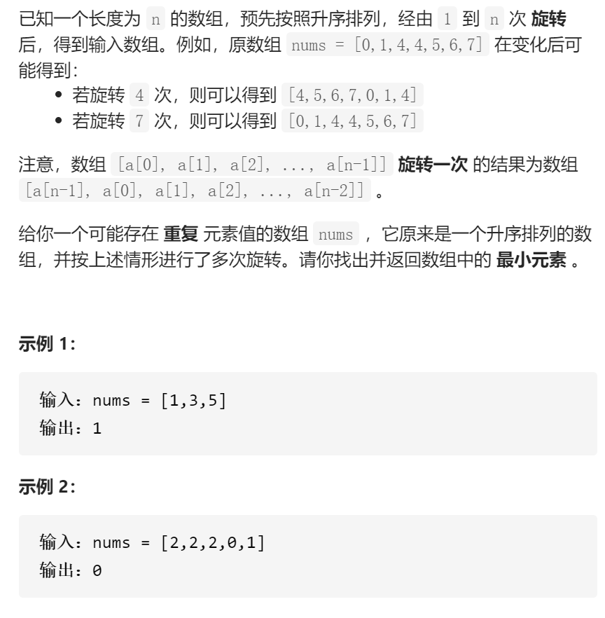

寻找旋转排序数组中的最小值II



变量简洁正确完整思路

二分，leftright，mid，如果left==right1个2个提前返回，如果[left]==[mid]或[right]

==[mid]++--防止11101或10111并记录[left][mid]，日过[left]<[mid]则非递减序列，记录[left]并排除，如果[mid]

<[right]则非递减，记录[mid]并排除，

```c
class Solution {
public:
    int findMin(vector<int>& nums) {
        int n=nums.size();
        int left=0,right=n-1;
        int ans=0x3f3f3f3f;
        while(left<=right){
            int mid=left+(right-left)/2;
            if(mid==left){
                ans=min(ans,nums[mid]);
                if(right==mid+1)ans=min(ans,nums[right]);
                return ans;
            }
            if(nums[left]==nums[mid]){
                ans=min(ans,nums[left]);
                left++;
            }else if(nums[mid]==nums[right]){
                ans=min(ans,nums[mid]);
                right--;
            }else if(nums[left]<nums[mid]){
                ans=min(ans,nums[left]);
                left=mid+1;
            }else if(nums[mid]<nums[right]){
                ans=min(ans,nums[mid]);
                right=mid-1;
            }
        }
        return ans;
    }
};
```

​	

```c
踩过的坑
            if(nums[left]==nums[mid])left++;
            else if(nums[right]==nums[mid])right--;
不这么做，10111找0根本无法判断哪个是非递减数组

           if(left==mid){
                if(nums[left]==target||nums[right]==target)return true;
                else return false;
            }
只有两个或一个先输出

             if(nums[left]<=target&&target<nums[mid])r
target在left处也算在非递减数组中
```


