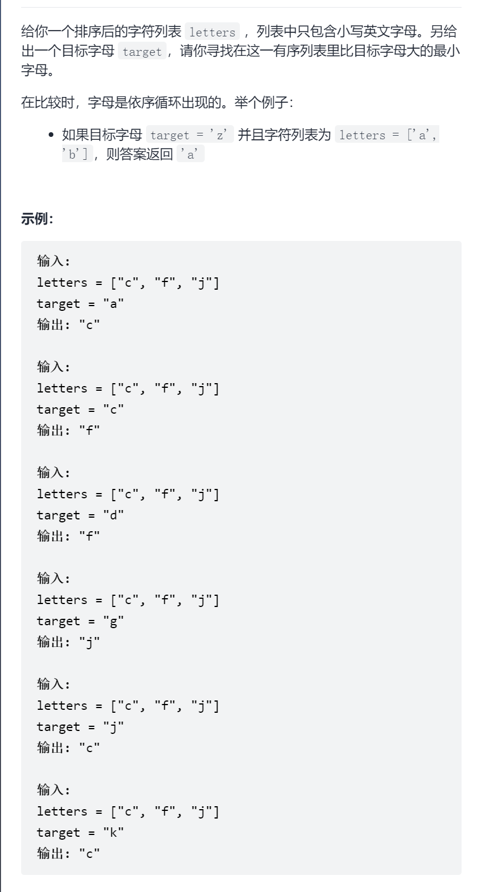

寻找比目标字母大的最小字母



抽象图一二ij

二分寻找第一个大于

```c
class Solution {
public:
    char nextGreatestLetter(vector<char>& letters, char target) {
        auto it=upper_bound(letters.begin(),letters.end(),target);
        if(it==letters.end())return letters[0];
        return *it;
    }
};


class Solution {
public:
    char nextGreatestLetter(vector<char>& letters, char target) {
        int left=0,right=letters.size()-1;
        while(left<right){
            int mid=left+(right-left)/2;
            //大于则找第一个大于
            if(letters[mid]>target)right=mid;
            else left=mid+1;
        }
        if(letters[left]<=target)return letters[0];
        return letters[left];
    }
};

```

