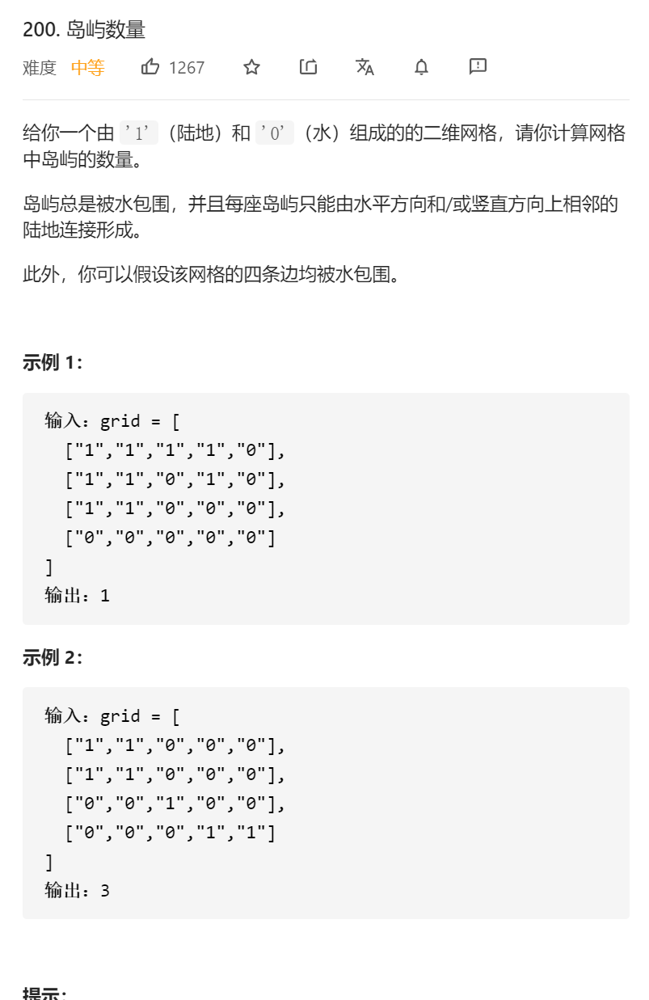

岛屿数量

变量简洁正确完整思路

dfs，开头vis和01和越界判断是否要走，找机会更新答案只有入口第一次vis和1更新答案

```c
class Solution {
public:
    int numIslands(vector<vector<char>>& grid) {
        int n=grid.size(),m=grid[0].size();
        int ans=0;
        vector<vector<int>>vis(n,vector<int>(m,0));
        for(int i=0;i<n;i++){
            for(int j=0;j<m;j++){
                if(!vis[i][j]&&grid[i][j]=='1'){
                    ans++;
                    dfs(i,j,grid,vis,n,m);
                }
            }
        }
        return ans;
    }
    void dfs(int x,int y,vector<vector<char>>&grid,vector<vector<int>>&vis,int n,int m){
        if(x<0||x>=n||y<0||y>=m||vis[x][y]||grid[x][y]=='0')return;
        vis[x][y]=1;
        int xx[4]={1,-1,0,0},yy[4]={0,0,1,-1};
        for(int i=0;i<4;i++){
            int dx=xx[i]+x,dy=yy[i]+y;
            dfs(dx,dy,grid,vis,n,m);
        }
    }
};
```


