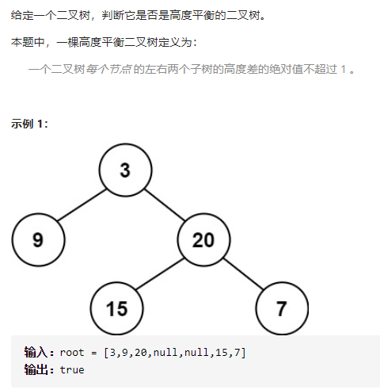

平衡二叉树



详细思路

判断每个节点的左右子树最大深度差，递归，dfs1形参root可判断整棵树是否为平衡二叉树，边界返回0，提前不满足返回，最后返回，提前不满足用深度，dfs2求最大深度，形参root可以求出root树的最大深度

精确定义

dfs1，形参root判断root树是否为平衡二叉树，空节点边界返回true，按照深度提前返回

dfs2，形参root求出root数的最大深度，root为空边界返回0，按照深度不符合提前返回，最后返回

```c
class Solution {
public:
    bool isBalanced(TreeNode* root) {
        return dfs1(root);
    }
    bool dfs1(TreeNode*root){
        if(!root)return true;
        if(abs(dfs2(root->left)-dfs2(root->right))>1)return false;
        return dfs1(root->left)&&dfs1(root->right);
    }
    int dfs2(TreeNode*root){
        if(!root)return 0;
        return 1+max(dfs2(root->left),dfs2(root->right));
    }
};
```


踩过的坑

abs的形参只有一个，二叉搜索树需要每个节点的左右子树深度差小于等于1