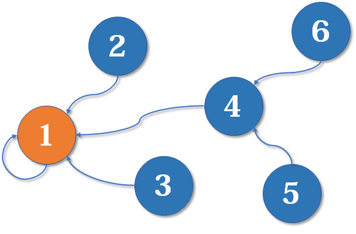
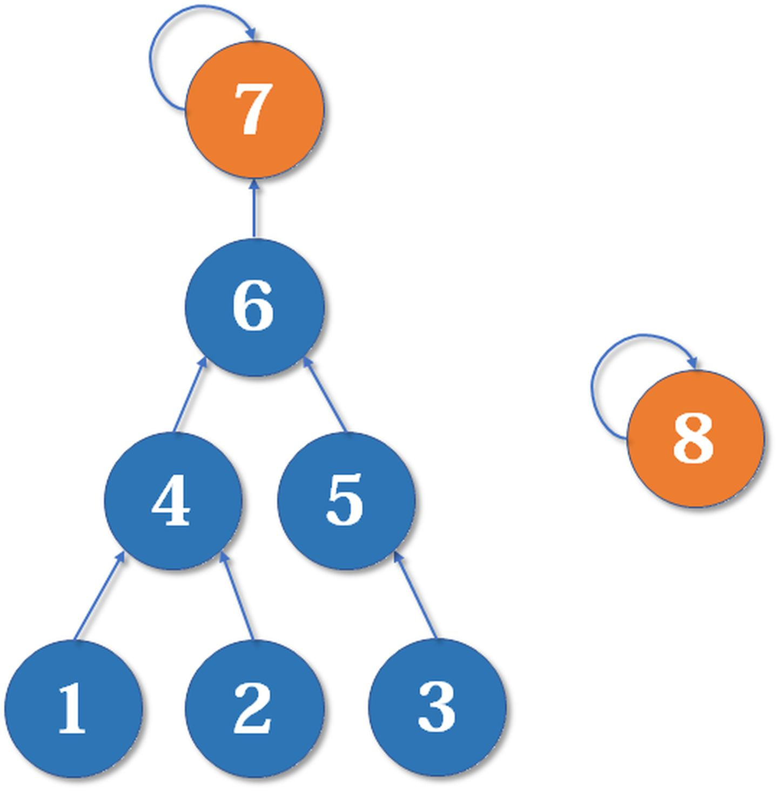
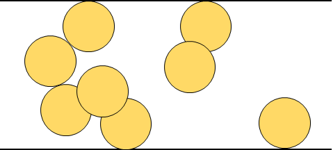

并查集被很多OIer认为是最简洁而优雅的数据结构之一，主要用于解决一些**元素分组**的问题。它管理一系列**不相交的集合**，并支持两种操作：

- **合并**（Union）：把两个不相交的集合合并为一个集合。
- **查询**（Find）：查询两个元素是否在同一个集合中。

当然，这样的定义未免太过学术化，看完后恐怕不太能理解它具体有什么用。所以我们先来看看并查集最直接的一个应用场景：**亲戚问题**。

**（洛谷P1551）亲戚**

> **题目背景**
> 若某个家族人员过于庞大，要判断两个是否是亲戚，确实还很不容易，现在给出某个亲戚关系图，求任意给出的两个人是否具有亲戚关系。
> **题目描述**
> 规定：x和y是亲戚，y和z是亲戚，那么x和z也是亲戚。如果x,y是亲戚，那么x的亲戚都是y的亲戚，y的亲戚也都是x的亲戚。
> **输入格式**
> 第一行：三个整数n,m,p，（n<=5000,m<=5000,p<=5000），分别表示有n个人，m个亲戚关系，询问p对亲戚关系。
> 以下m行：每行两个数Mi，Mj，1<=Mi，Mj<=N，表示Mi和Mj具有亲戚关系。
> 接下来p行：每行两个数Pi，Pj，询问Pi和Pj是否具有亲戚关系。
> **输出格式**
> P行，每行一个’Yes’或’No’。表示第i个询问的答案为“具有”或“不具有”亲戚关系。

这其实是一个很有现实意义的问题。我们可以建立模型，把所有人划分到若干个不相交的集合中，每个集合里的人彼此是亲戚。为了判断两个人是否为亲戚，只需看它们是否属于同一个集合即可。因此，这里就可以考虑用并查集进行维护了。

------

## 并查集的引入

并查集的重要思想在于，**用集合中的一个元素代表集合**。我曾看过一个有趣的比喻，把集合比喻成**帮派**，而代表元素则是**帮主**。接下来我们利用这个比喻，看看并查集是如何运作的。


最开始，所有大侠各自为战。他们各自的帮主自然就是自己。*（对于只有一个元素的集合，代表元素自然是唯一的那个元素）*

现在1号和3号比武，假设1号赢了（这里具体谁赢暂时不重要），那么3号就认1号作帮主*（合并1号和3号所在的集合，1号为代表元素）*。


现在2号想和3号比武*（合并3号和2号所在的集合）*，但3号表示，别跟我打，让我帮主来收拾你*（合并代表元素）*。不妨设这次又是1号赢了，那么2号也认1号做帮主。


现在我们假设4、5、6号也进行了一番帮派合并，江湖局势变成下面这样：


现在假设2号想与6号比，跟刚刚说的一样，喊帮主1号和4号出来打一架（帮主真辛苦啊）。1号胜利后，4号认1号为帮主，当然他的手下也都是跟着投降了。



好了，比喻结束了。如果你有一点图论基础，相信你已经觉察到，这是一个**树**状的结构，要寻找集合的代表元素，只需要一层一层往上访问**父节点**（图中箭头所指的圆），直达树的**根节点**（图中橙色的圆）即可。根节点的父节点是它自己。我们可以直接把它画成一棵树：

（好像有点像个火柴人？）

用这种方法，我们可以写出最简单版本的并查集代码。

### 初始化

```c
int fa[MAXN];
inline void init(int n)
{
    for (int i = 1; i <= n; ++i)
        fa[i] = i;
}
```

假如有编号为1, 2, 3, ..., n的n个元素，我们用一个数组fa[]来存储每个元素的父节点（因为每个元素有且只有一个父节点，所以这是可行的）。一开始，我们先将它们的父节点设为自己。

### 查询

```c
int find(int x)
{
    if(fa[x] == x)
        return x;
    else
        return find(fa[x]);
}
```

我们用递归的写法实现对代表元素的查询：一层一层访问父节点，直至根节点（根节点的标志就是父节点是本身）。要判断两个元素是否属于同一个集合，只需要看它们的根节点是否相同即可。

### 合并

```c
inline void merge(int i, int j)
{
    fa[find(i)] = find(j);
}
```

合并操作也是很简单的，先找到两个集合的代表元素，然后将前者的父节点设为后者即可。当然也可以将后者的父节点设为前者，这里暂时不重要。本文末尾会给出一个更合理的比较方法。

------

## 路径压缩

最简单的并查集效率是比较低的。例如，来看下面这个场景：


现在我们要merge(2,3)，于是从2找到1，fa[1]=3，于是变成了这样：


然后我们又找来一个元素4，并需要执行merge(2,4)：


从2找到1，再找到3，然后fa[3]=4，于是变成了这样：


大家应该有感觉了，这样可能会形成一条长长的**链**，随着链越来越长，我们想要从底部找到根节点会变得越来越难。

怎么解决呢？我们可以使用**路径压缩**的方法。既然我们只关心一个元素对应的**根节点**，那我们希望每个元素到根节点的路径尽可能短，最好只需要一步，像这样：


其实这说来也很好实现。只要我们在查询的过程中，**把沿途的每个节点的父节点都设为根节点**即可。下一次再查询时，我们就可以省很多事。这用递归的写法很容易实现：

### 合并（路径压缩）

```c
int find(int x)
{
    if(x == fa[x])
        return x;
    else{
        fa[x] = find(fa[x]);  //父节点设为根节点
        return fa[x];         //返回父节点
    }
}
```

以上代码常常简写为一行：

```c
int find(int x)
{
    return x == fa[x] ? x : (fa[x] = find(fa[x]));
}
```

注意赋值运算符=的优先级没有三元运算符?:高，这里要加括号。

路径压缩优化后，并查集的时间复杂度已经比较低了，绝大多数不相交集合的合并查询问题都能够解决。然而，对于某些时间卡得很紧的题目，我们还可以进一步优化。

------

## 按秩合并

有些人可能有一个误解，以为路径压缩优化后，并查集始终都是一个**菊花图**（只有两层的树的俗称）。但其实，由于路径压缩只在查询时进行，也只压缩一条路径，所以并查集最终的结构仍然可能是比较复杂的。例如，现在我们有一棵较复杂的树需要与一个单元素的集合合并：



假如这时我们要merge(7,8)，如果我们可以选择的话，是把7的父节点设为8好，还是把8的父节点设为7好呢？

当然是后者。因为如果把7的父节点设为8，会使树的**深度**（树中最长链的长度）加深，原来的树中每个元素到根节点的距离都变长了，之后我们寻找根节点的路径也就会相应变长。虽然我们有路径压缩，但路径压缩也是会消耗时间的。而把8的父节点设为7，则不会有这个问题，因为它没有影响到不相关的节点。


这启发我们：我们应该把简单的树往复杂的树上合并，而不是相反。因为这样合并后，到根节点距离变长的节点个数比较少。

我们用一个数组rank[]记录每个根节点对应的树的深度（如果不是根节点，其rank相当于以它作为根节点的**子树**的深度）。一开始，把所有元素的rank（**秩**）设为1。合并时比较两个根节点，把rank较小者往较大者上合并。

路径压缩和按秩合并如果一起使用，时间复杂度接近 ![[公式]](https://www.zhihu.com/equation?tex=O%28n%29) ，但是很可能会破坏rank的准确性。

### 初始化（按秩合并）

```c
inline void init(int n)
{
    for (int i = 1; i <= n; ++i)
    {
        fa[i] = i;
        rank[i] = 1;
    }
}
```

### 合并（按秩合并）

```c
inline void merge(int i, int j)
{
    int x = find(i), y = find(j);    //先找到两个根节点
    if (rank[x] <= rank[y])
        fa[x] = y;
    else
        fa[y] = x;
    if (rank[x] == rank[y] && x != y)
        rank[y]++;                   //如果深度相同且根节点不同，则新的根节点的深度+1
}
```

为什么深度相同，新的根节点深度要+1？如下图，我们有两个深度均为2的树，现在要merge(2,5)：


这里把2的父节点设为5，或者把5的父节点设为2，其实没有太大区别。我们选择前者，于是变成这样：


显然树的深度增加了1。另一种合并方式同样会让树的深度+1。

------

## 并查集的应用

我们先给出亲戚问题的AC代码：

```cpp
#include <cstdio>
#define MAXN 5005
int fa[MAXN], rank[MAXN];
inline void init(int n)
{
    for (int i = 1; i <= n; ++i)
    {
        fa[i] = i;
        rank[i] = 1;
    }
}
int find(int x)
{
    return x == fa[x] ? x : (fa[x] = find(fa[x]));
}
inline void merge(int i, int j)
{
    int x = find(i), y = find(j);
    if (rank[x] <= rank[y])
        fa[x] = y;
    else
        fa[y] = x;
    if (rank[x] == rank[y] && x != y)
        rank[y]++;
}
int main()
{
    int n, m, p, x, y;
    scanf("%d%d%d", &n, &m, &p);
    init(n);
    for (int i = 0; i < m; ++i)
    {
        scanf("%d%d", &x, &y);
        merge(x, y);
    }
    for (int i = 0; i < p; ++i)
    {
        scanf("%d%d", &x, &y);
        printf("%s\n", find(x) == find(y) ? "Yes" : "No");
    }
    return 0;
}
```

接下来我们来看一道NOIP提高组原题：

**（NOIP提高组2017年D2T1 洛谷P3958 奶酪）**

> **题目描述**
> 现有一块大奶酪，它的高度为 ![[公式]](https://www.zhihu.com/equation?tex=h) ，它的长度和宽度我们可以认为是无限大的，奶酪中间有许多半径相同的球形空洞。我们可以在这块奶酪中建立空间坐标系，在坐标系中， 奶酪的下表面为 ![[公式]](https://www.zhihu.com/equation?tex=z%3D0) ，奶酪的上表面为 ![[公式]](https://www.zhihu.com/equation?tex=z+%3D+h) 。
> 现在，奶酪的下表面有一只小老鼠 Jerry，它知道奶酪中所有空洞的球心所在的坐标。如果两个空洞相切或是相交，则 Jerry 可以从其中一个空洞跑到另一个空洞，特别地，如果一个空洞与下表面相切或是相交，Jerry 则可以从奶酪下表面跑进空洞；如果一个空洞与上表面相切或是相交，Jerry 则可以从空洞跑到奶酪上表面。
> 位于奶酪下表面的 Jerry 想知道，在 不破坏奶酪 的情况下，能否利用已有的空洞跑到奶酪的上表面去?
> 空间内两点 ![[公式]](https://www.zhihu.com/equation?tex=P_1%28x_1%2Cy_1%2Cz_1%29) 、 ![[公式]](https://www.zhihu.com/equation?tex=P2%28x_2%2Cy_2%2Cz_2%29) 的距离公式如下：
> ![[公式]](https://www.zhihu.com/equation?tex=%5Cmathrm%7Bdist%7D%28P_1%2CP_2%29%3D%5Csqrt%7B%28x_1-x_2%29%5E2%2B%28y_1-y_2%29%5E2%2B%28z_1-z_2%29%5E2%7D)
> **输入格式**
> 每个输入文件包含多组数据。
> 的第一行，包含一个正整数 ![[公式]](https://www.zhihu.com/equation?tex=T) ，代表该输入文件中所含的数据组数。
> 接下来是 ![[公式]](https://www.zhihu.com/equation?tex=T) 组数据，每组数据的格式如下： 第一行包含三个正整数 ![[公式]](https://www.zhihu.com/equation?tex=n%2Ch) 和 ![[公式]](https://www.zhihu.com/equation?tex=r) ，两个数之间以一个空格分开，分别代表奶酪中空 洞的数量，奶酪的高度和空洞的半径。
> 接下来的 ![[公式]](https://www.zhihu.com/equation?tex=n) 行，每行包含三个整数 ![[公式]](https://www.zhihu.com/equation?tex=+x%2Cy%2Cz) ，两个数之间以一个空格分开，表示空 洞球心坐标为 ![[公式]](https://www.zhihu.com/equation?tex=%28x%2Cy%2Cz%29) 。
> **输出格式**
> ![[公式]](https://www.zhihu.com/equation?tex=T)行，分别对应![[公式]](https://www.zhihu.com/equation?tex=T)组数据的答案，如果在第 ![[公式]](https://www.zhihu.com/equation?tex=i) 组数据中，Jerry 能从下表面跑到上表面，则输出`Yes`，如果不能，则输出`No`（均不包含引号）。

大家看出这道题和并查集的关系了吗？

这是二维版本，题目中的三维版本是类似的

大家看看上面这张图，是不是看出一些门道了？我们把所有空洞划分为若干个集合，一旦两个空洞相交或相切，就把它们放到同一个集合中。

我们还可以划出2个**特殊元素**，分别表示**底部**和**顶部**，如果一个空洞与底部接触，则把它与表示底部的元素放在同一个集合中，顶部同理。最后，只需要看**顶部和底部是不是在同一个集合中**即可。这完全可以通过并查集实现。来看代码：

```cpp
#include <cstdio>
#include <cstring>
#define MAXN 1005
typedef long long ll;
int fa[MAXN], rank[MAXN];
ll X[MAXN], Y[MAXN], Z[MAXN];
inline bool next_to(ll x1, ll y1, ll z1, ll x2, ll y2, ll z2, ll r)
{
    return (x1 - x2) * (x1 - x2) + (y1 - y2) * (y1 - y2) + (z1 - z2) * (z1 - z2) <= 4 * r * r;
    //判断两个空洞是否相交或相切
}
inline void init(int n)
{
    for (int i = 1; i <= n; ++i)
    {
        fa[i] = i;
        rank[i] = 1;
    }
}
int find(int x)
{
    return x == fa[x] ? x : (fa[x] = find(fa[x]));
}
inline void merge(int i, int j)
{
    int x = find(i), y = find(j);
    if (rank[x] <= rank[y])
        fa[x] = y;
    else
        fa[y] = x;
    if (rank[x] == rank[y] && x != y)
        rank[y]++;
}
int main()
{
    int T, n, h;
    ll r;
    scanf("%d", &T);
    for (int I = 0; I < T; ++I)
    {
        memset(X, 0, sizeof(X));
        memset(Y, 0, sizeof(Y));
        memset(Z, 0, sizeof(Z));
        scanf("%d%d%lld", &n, &h, &r);
        init(n);
        fa[1001] = 1001; //用1001代表底部
        fa[1002] = 1002; //用1002代表顶部
        for (int i = 1; i <= n; ++i)
            scanf("%lld%lld%lld", X + i, Y + i, Z + i);
        for (int i = 1; i <= n; ++i)
        {
            if (Z[i] <= r)
                merge(i, 1001); //与底部接触的空洞与底部合并
            if (Z[i] + r >= h)
                merge(i, 1002); //与顶部接触的空洞与顶部合并
        }
        for (int i = 1; i <= n; ++i)
        {
            for (int j = i + 1; j <= n; ++j)
            {
                if (next_to(X[i], Y[i], Z[i], X[j], Y[j], Z[j], r))
                    merge(i, j); //遍历所有空洞，合并相交或相切的球
            }
        }
        printf("%s\n", find(1001) == find(1002) ? "Yes" : "No");
    }
    return 0;
}
```

因为数据范围的原因，这里要开一个long long。

并查集的应用还有很多，例如最小生成树的Kruskal算法等。这里就不细讲了。总而言之，凡是涉及到元素的分组管理问题，都可以考虑使用并查集进行维护。