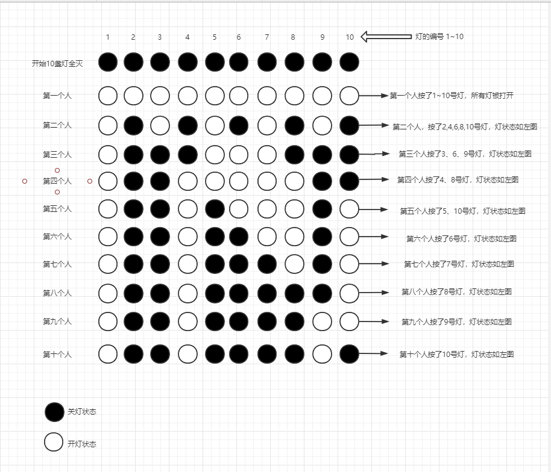
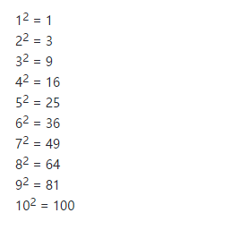

题目
一间屋子里有100盏灯排成一行，按从左至右的顺序编号1、2、3、4、5…99、100，每盏灯都有一个开关，开始全部都关着，现有100个学生，第1个学生把1的倍数的灯全部拉一下，第2个学生把2的倍数灯全部都拉一下，第3个学生把3的倍数灯全部都拉一下…第100个学生把100的倍数灯全部都拉一下，这时灯有多少是开着的？

解法一
思路：

1、第1个学生按了1的倍数的灯，也就说被按灯的编号为：1、2、3、4、5、6、7、8…99、100
2、第2个学生按了2的倍数的灯，也就说被按灯的编号为：2、4、6、8、10…98、100
3、第3个学生按了3的倍数的灯，也就说被按灯的编号为：3、6、9、12…99
4、以此类推…
基于上面的思路，我们创建一个数组 boolean[] arr = new boolean[101]记录所有的灯的开关状态,初始值 false 表示灯是关着的。当某一个灯被按了1次将值改为 true 表示灯是开着的，当这个灯再次被按了一次，将值改为 false，表示灯被关了。这个数组记录了所有灯开关状态，最后只要找到数组中所有值为true 的角标，就是我们要的结果。数组的长度为101，主要为了计算方便，咱们从数组角标1开始。

所以现在只要计算出，每一个学生都按了哪些灯，然后改变一下灯的状态，结果就出来了。

代码如下

```c
private static void count() {
        //false：表示灯是关着的，true：表示灯是开着的
        boolean[] arr = new boolean[101];
        for(int i = 1;i < 101;i++){
            System.out.print("第"+i+"个学生按了灯的编号为：");
            for(int j = i  ;j < 101; j = j + i){
                //打印每一个学生按的灯的编号
                System.out.print(j+" ");
                //如果之前灯的状态为false,被按了一次之后，状态值变为true。反之亦然。
                arr[j] = !arr[j];
            }
            System.out.print("\n\n");
        }
        int count = 0;
        System.out.print("开灯的编号：");
        for(int i = 1;i < 101;i++){
            if (arr[i]) {
                System.out.print(i+" ");
                count++;
            }
        }
        System.out.print("\n");
        System.out.print("开灯的总数量："+count);
    }
```


打印结果

```
开灯的编号：1 4 9 16 25 36 49 64 81 100 
开灯的总数量：10
```

解法二
思路：
其实就是求1-100中，完全平方数有几个？为什么是求1-100中的完全平方数，下面详解。

因为灯开始都是关着的，所以某一个灯被按了奇数次，灯就是开的。现在我们只要得到被按奇数次的灯的编号即可得到结果。

我们通过画图模拟这一场景，只模拟10盏灯的情况。



总结一下：

1号灯：被按了1次，仅被第1个学生按了
2号灯：被按了2次，被第1和第2个学生按了
3号灯：被按了2次，被第1和第3个学生按了
4号灯：被按了3次，被第1、第2和第4个学生按了
5号灯：被按了2次，被第1和第5个学生按了
6号灯：被按了4次，被第1、第2、第3和第6个学生按了
7号灯：被按了2次，被第1和第7个学生按了
8号灯：被按了4次，被第1、第2、第4、和第8个学生按了
9号灯：被按了3次，被第1、第3和第9个学生按了
10号灯：被按了2次，被第1和第10个学生按了
上面我们得出，灯只要被按了奇数次，灯就是开的，所以1、4、9号灯是开的，这跟画图模拟结果一致。

下面分析一下：

1号灯是开的，1号学生按了
4号灯是开的，分别由1、2、4号学生按了；
依次来推…
8号灯是关的，分别由1、2、4、8号学生按了；
9号灯是开的，分别由1、3、9号学生按了；
基于上面的结果我们猜测：每盏灯按的次数与灯的编号所含约数的个数有关。 比如4号灯，4的约数为 1、2、4，所以4号灯被按了3次。比如8号灯，8的约数是 1、2、4、8，所以8号灯被按了4次。9号灯同理。所以我们只要找到1~100这些数中约数个数是奇数的数。

什么是约数，不知道的百度。那1~100中哪些数的约数的个数是奇数？一般来说，一个数的约数都是成对出现的，所以一般一个数的约数的个数都是偶数，如上述8的约数 1、2、4、8。
但是也有例外:

如9的约数有 1、3、9
如16的约数有 1、2、4、8、16
如36的约数有 1、2、3、4、6、9、12、18、36
上面举例9、16、36的约数的个数都是奇数，为什么？因为有一个约数相等了，如 9 的约数有 1、3、3、9，但是3是相等的，所以去掉一个。同理16、36约数的个数是奇数的原因都是如此。

所以我们得出结论，约数个数为奇数的数就是一个完全平方数。如



这个结论与解法一相同。综上我们得出，100盏灯的问题其实就是求1-100中，完全平方数有几个。
