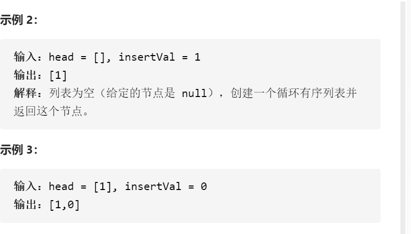
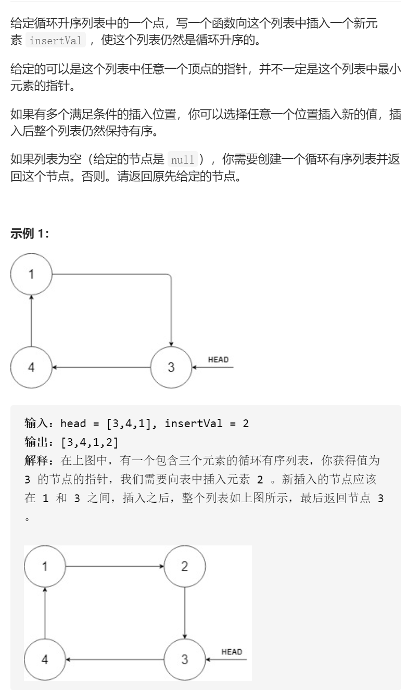

循环有序列表的插入



```c
class Solution {
public:
    Node* insert(Node* head, int insertVal) {
        if(!head){
            Node*tmp=new Node(insertVal);
            tmp->next=tmp;
            return tmp;
        }
        if(head->next==head){
            Node*tmp=new Node(insertVal);
            tmp->next=head;
            head->next=tmp;
            return head;
        }
        Node*pre;
        bool smallAll=false,bigAll=false;
        if(insertVal<=head->val){
            //cout<<1;
            smallAll=true;
            pre=head->next;
            Node*last=pre;
            while(pre!=head){
                if(insertVal>pre->val){
                    smallAll=false;
                    break;
                }
                pre=pre->next;
                if(last->val<=pre->val)last=pre;
            }
            if(smallAll){
                pre=last;
            }
            //cout<<smallAll<<endl;
        }else if(insertVal>head->val){
            //cout<<2;
            bigAll=true;
            pre=head->next;
            Node*last=pre;
            while(pre!=head){
                if(insertVal<=pre->val){
                    bigAll=false;
                    break;
                }
                pre=pre->next;
                
                if(last->val<=pre->val)last=pre;
            }
            if(bigAll)pre=last;
            //cout<<bigAll<<endl;
        }
        if(smallAll==false&&bigAll==false){
            //cout<<3<<endl;
            pre=head;
            while(1){
                int preVal=pre->val;
                int curVal=pre->next->val;
                if(preVal<=insertVal&&insertVal<=curVal)break;
                pre=pre->next;
            }
        }
        Node*tmp=new Node(insertVal);
        tmp->next=pre->next;
        pre->next=tmp;
        return head;

    }
};
```

