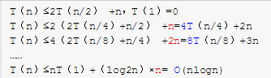
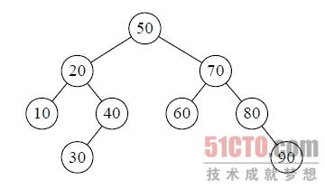
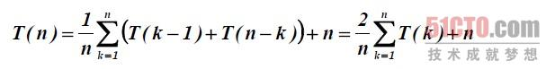

这个答案还得看枢轴（pivot）的选择策略。在快速排序的早期版本中呢，最左面或者是最右面的那个元素被选为枢轴，那最坏的情况就会在下面的情况下发生啦：

1）数组已经是正序（same order）排过序的。
2）数组已经是倒序排过序的。
3）所有的元素都相同（1、2的特殊情况）

因为这些案例在用例中十分常见，所以这个问题可以通过要么选择一个随机的枢轴，或者选择一个分区中间的下标作为枢轴，或者（特别是对于相比更长的分区）选择分区的第一个、中间、最后一个元素的中值作为枢轴。有了这些修改，那快排的最差的情况就不那么容易出现了，但是如果输入的数组最大（或者最小元素）被选为枢轴，那最坏的情况就又来了。

------

排序算法一般都是笔试和面试中的重点，这里我们简单简单总结一下常用的排序算法——快速排序

 

快速排序在一趟排序中将数字分割成为独立的两部分，左边一部分小于轴值，右边一部分大于轴值，轴值的选择理论上可以选择数组中的任何一个数组，我们在这里考虑选择第一个数字。然后对两部分序列重复进行上述操作，快速排序可以用递归来完成

时间复杂度：**最好**情况O(n*logn)——Partition函数每次恰好能均分序列，其递归树的深度就为.log2n.+1（.x.表示不大于x的最大整数），即仅需递归log2n次； **最坏**情况O（n^2）,每次划分只能将序列分为一个元素与其他元素两部分，这时的快速排序退化为冒泡排序，如果用数画出来，得到的将会是一棵单斜树，也就是说所有所有的节点只有左（右）节点的树；平均时间复杂度O(n*logn)



------

我们来分析一下快速排序法的性能。快速排序的时间性能取决于快速排序递归的深度，可以用递归树来描述[递归算法](https://so.csdn.net/so/search?from=pc_blog_highlight&q=递归算法)的执行情况。如图9‐9‐7所示，它是{50,10,90,30, 70,40,80,60,20}在快速排序过程中的递归过程。由于我们的第一个关键字是50，正好是待排序的序列的中间值，因此递归树是平衡的，此时性能也比较好。

| [](http://images.51cto.com/files/uploadimg/20110826/222536597.jpg) |
| ------------------------------------------------------------ |
| 图9-9-7                                                      |

在最优情况下，Partition每次都划分得很均匀，如果排序n个关键字，其递归树的深度就为.log2n.+1（.x.表示不大于x的最大整数），即仅需递归log2n次，需要时间为T（n）的话，第一次Partiation应该是需要对整个数组扫描一遍，做n次比较。然后，获得的枢轴将数组一分为二，那么各自还需要T（n/2）的时间（注意是最好情况，所以平分两半）。于是不断地划分下去，我们就有了下面的不等式推断。

```
 T（n）≤2T（n/2） +n，T（1）=0  T（n）≤2（2T（n/4）+n/2） +n=4T（n/4）+2n  T（n）≤4（2T（n/8）+n/4） +2n=8T（n/8）+3n  ……  T（n）≤nT（1）+（log2n）×n= O(nlogn) 
```

也就是说，在最优的情况下，快速排序算法的时间复杂度为O(nlogn)。

在最坏的情况下，待排序的序列为正序或者逆序，每次划分只得到一个比上一次划分少一个记录的子序列，注意另一个为空。如果递归树画出来，它就是一棵斜树。此时需要执行n‐1次递归调用，且第i次划分需要经过n‐i次关键字的比较才能找到第i个记录，也就是枢轴的位置，因此比较次数为[](http://images.51cto.com/files/uploadimg/20110826/222653304.jpg) ，最终其时间复杂度为O(n2)。

平均的情况，设枢轴的关键字应该在第k的位置（1≤k≤n），那么：


[](http://images.51cto.com/files/uploadimg/20110826/222801489.jpg) 


由数学归纳法可证明，其数量级为O(nlogn)。

就空间复杂度来说，主要是递归造成的栈空间的使用，最好情况，递归树的深度为log2n，其空间复杂度也就为O(logn)，最坏情况，需要进行n‐1递归调用，其空间复杂度为O(n)，平均情况，空间复杂度也为O(logn)。

可惜的是，由于关键字的比较和交换是跳跃进行的，因此，快速排序是一种不稳定的排序方法。