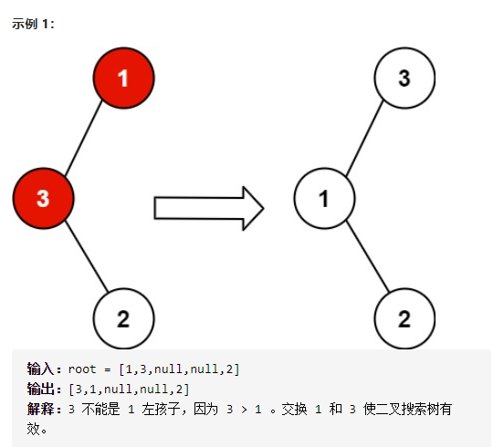
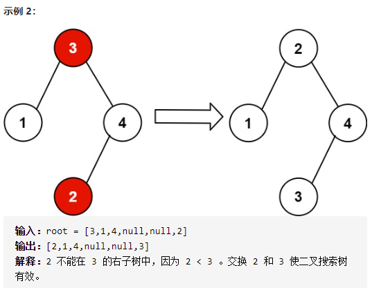

恢复二叉搜索树



详细思路

中序遍历，123456变125436，只需要发现异常的第一对54 和第二对43，要有node1记录第一个异常，node2记录第二个异常，pre记录上一次节点；然后交换node1和node2的值

精确定义

dfs中序遍历

node1第一个异常：5

node2第二个异常：3

pre上次

```c
class Solution {
public:
    TreeNode*node1,*node2,*pre;
    void recoverTree(TreeNode* root) {
        dfs(root);
        int temp=node1->val;
        node1->val=node2->val;
        node2->val=temp;
        return;
    }
    void dfs(TreeNode*root){
        if(!root)return ;
        dfs(root->left);
        if(pre&&pre->val>root->val){
            if(!node1)node1=pre;
            node2=root;
        }
        pre=root;
        dfs(root->right);
    }
};
```

踩过的坑

​    if(pre&&pre->val>root->val){

​      if(!node1)node1=pre;

​      node2=root;

​    }

之所以node2不用else if，是因为如果1324，只有一对不满足的，就要交换32，node2理应是root，

加了else就会让node2为nullptr

详细思路

莫里斯遍历，在两处更新答案的地方操作便可

```c
class Solution {
public:
    void recoverTree(TreeNode* root) {
        TreeNode*pre,*cur=root;
        TreeNode*node1=nullptr,*node2=nullptr,*last=nullptr;
        while(cur){
            if(cur->left){
                //找到pre
                //如果pre->right不存在说明是下降期，连接pre去下一个节点
                //如果pre->right为cur说明是上升期，更新答案断开pre去下一个节点，当上升期结束正好去下一个节点是右子树
                pre=cur->left;
                while(pre->right&&pre->right!=cur)pre=pre->right;
                if(!pre->right){
                    pre->right=cur;
                    cur=cur->left;
                }
                else if(pre->right==cur){
                    if(last&&last->val>cur->val){
                        if(!node1)node1=last;
                        node2=cur;
                    }
                    last=cur;
                    pre->right=nullptr;
                    cur=cur->right;
                }
            }
            //如果没有左孩子，说明需要更新答案通过上升箭头上升
            else if(!cur->left){
                if(last&&last->val>cur->val){
                    if(!node1)node1=last;
                    node2=cur;
                }
                last=cur;
                cur=cur->right;
            }
        }
        int temp=node1->val;
        node1->val=node2->val;
        node2->val=temp;
        return;
    }
};
```

