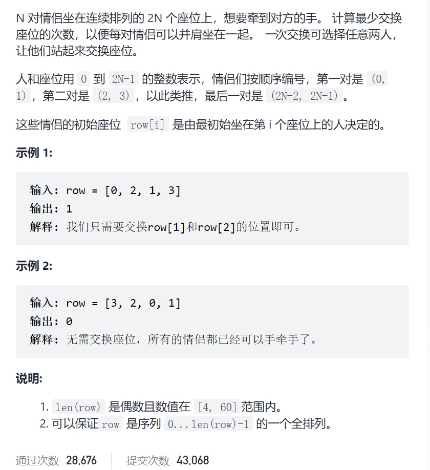
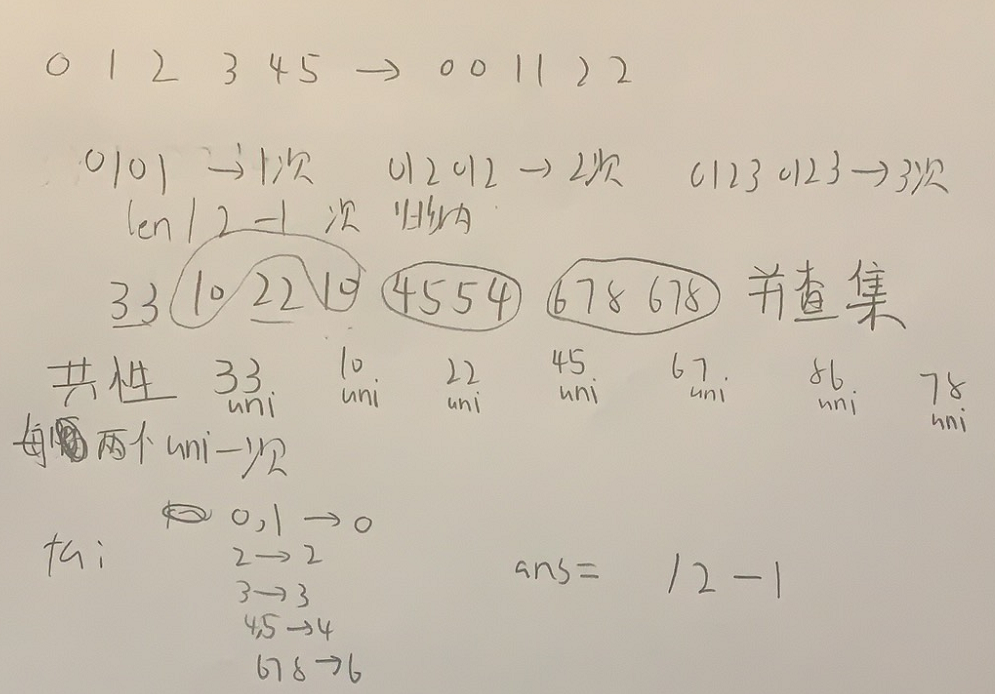

情侣牵手



抽象图一二ij



```c
class UF{
public:
    int fa[65],rank[65];
    UF(int n){
        for(int i=0;i<n;i++){
            fa[i]=i;
            rank[i]=1;
        }
    }
    int find(int x){
        return x==fa[x]?x:(fa[x]=find(fa[x]));
    }
    void uni(int i,int j){
        int x=find(i),y=find(j);
        if(rank[x]<=rank[y])fa[x]=y;
        else fa[y]=x;
        if(rank[x]==rank[y]&&x!=y)rank[y]++;
    }
};
class Solution {
public:
    int minSwapsCouples(vector<int>& row) {
        vector<int>nums(row);
        int n=nums.size();
        for(int i=0;i<n;i++){
            nums[i]/=2;
        }
        UF uf(n);
        for(int i=0;i<n;i+=2){
            uf.uni(nums[i],nums[i+1]);
        }
        unordered_map<int,int>fa2len;
        for(int i=0;i<n;i++){
            fa2len[uf.find(nums[i])]++;
        }
        int ans=0;
        for(auto mPair:fa2len){
            ans+=mPair.second/2-1;
        }
        return ans;
    }
};
```

