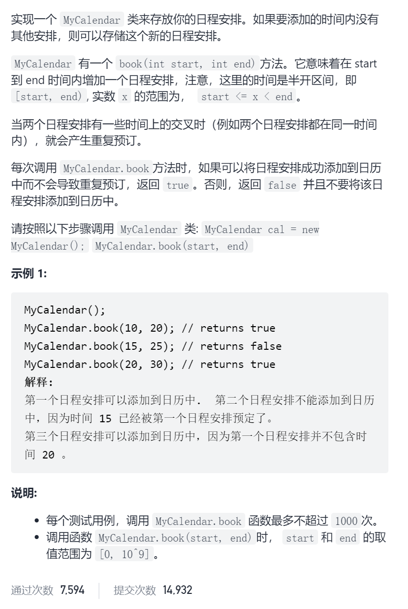
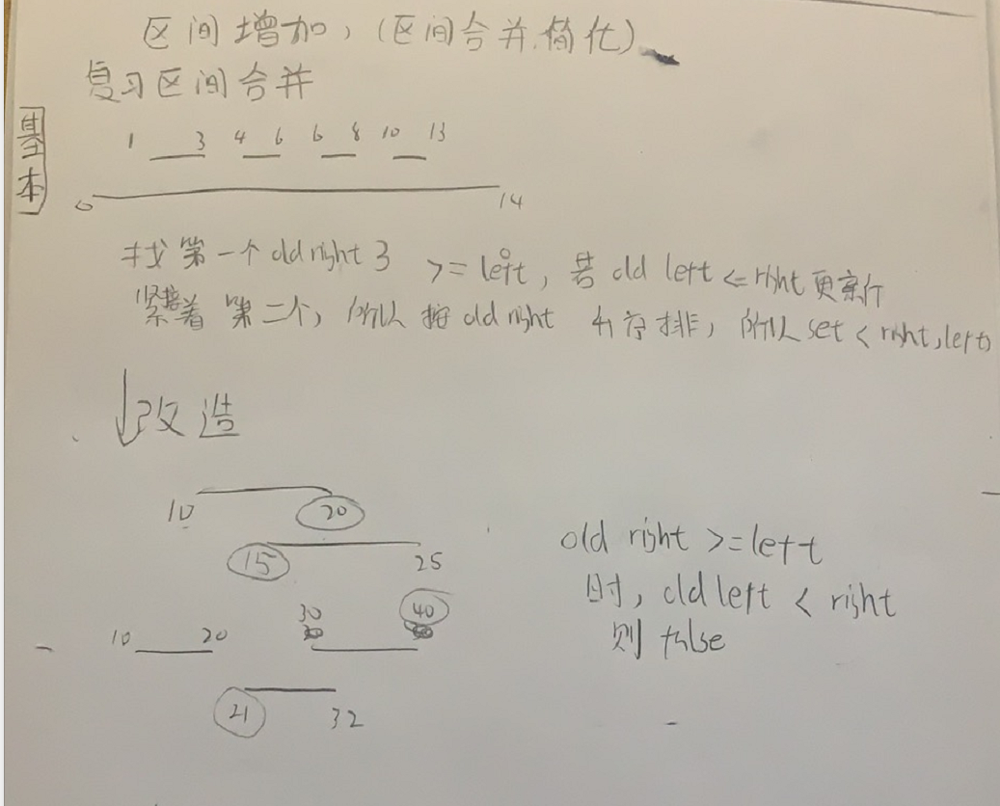

我的日程安排表I



区间合并



```c

class MyCalendar {
public:
    set<pair<int,int>>right2left;
    MyCalendar() {
    }
    
    bool book(int start, int end) {
        auto it=right2left.upper_bound({start,INT_MAX});
        if(it!=right2left.end()&&it->second<end)return false;
        right2left.emplace(end,start);
        return true;
    }
};
```


踩过的坑

upper_bound({start,INT_MAX})

oldleft必须大于start，没有任何可以大于INT_MAX的