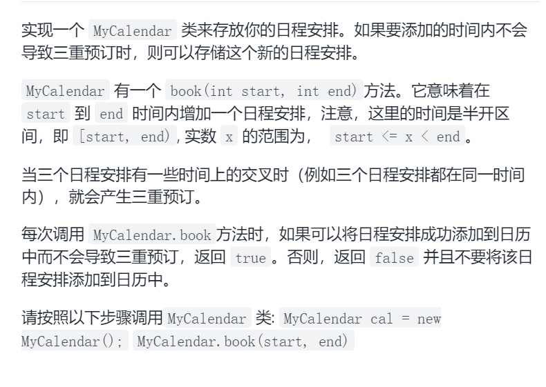

我的日程安排表II

区间合并类型题，维护二重区间和一重区间，判断二重是否相交，是直接false，否则先插入一重区间，在过程中插入二重区间

```c
class MyCalendarTwo {
public:
    set<pair<int,int>>one,two;
    MyCalendarTwo() {
    }
    bool book(int start, int end) {
        auto it=two.upper_bound({start,INT_MAX});
        if(it!=two.end()&&it->second<end)return false;
        it=one.lower_bound({start,0});
        while(it!=one.end()&&end>=it->second){
            addSecond(max(it->second,start),min(it->first,end));
            start=min(start,it->second);
            end=max(end,it->first);
            it=one.erase(it);
        }
        one.emplace(end,start);
        return true;
    }
    void addSecond(int left,int right){
        if(left==right)return;
        auto it=two.lower_bound({left,0});
        while(it!=two.end()&&right>=it->second){
            left=min(left,it->second);
            right=max(right,it->first);
            it=two.erase(it);
        }
        two.emplace(right,left);
    }
};
```

