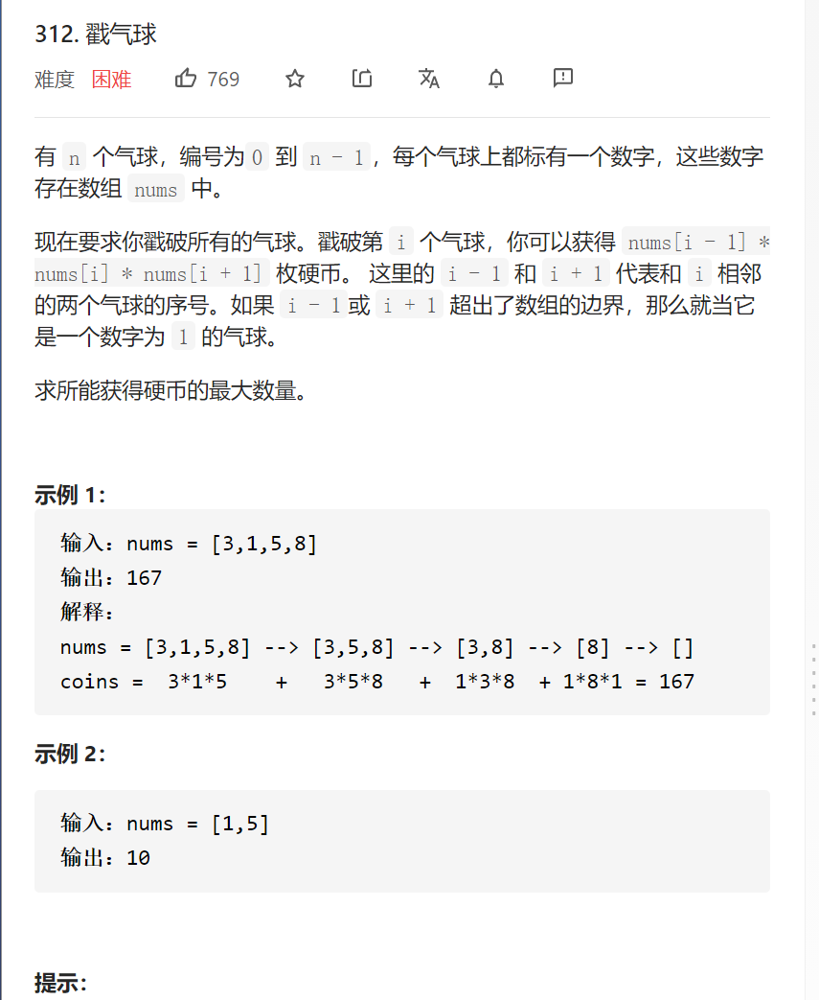

戳气球



变量简洁正确完整思路

反过来放入气球得分，两边加11防止边界，dfs(left,right)可以得到left到right区间的答案不包括leftright，只需要选一个i作为第一个插入的气球，val[right]*val[i]*val[right]+

dfs(left,i)+dfs(i,right)的最大值作为答案返回，边界left==right-1返回0

```c
class Solution {
public:
    vector<int>vals;
    int maxCoins(vector<int>& nums) {
        int n=nums.size();
        vals.resize(n+2,1);
        for(int i=1;i<=n;i++){
            vals[i]=nums[i-1];
        }
        return dfs(0,n+1);
    }
    int dfs(int left,int right){
        if(left==right-1)return 0;
        int ans=0;
        for(int i=left+1;i<=right-1;i++){
            int ans1=vals[left]*vals[i]*vals[right]+dfs(left,i)+dfs(i,right);
            ans=max(ans,ans1);
        }
        return ans;
    }
};

```


记忆化搜索，显然可以将ans记忆化

```c
class Solution {
public:
    vector<int>vals;
    vector<vector<int>>ans;
    int maxCoins(vector<int>& nums) {
        int n=nums.size();
        vals.resize(n+2,1);
        ans.resize(n+2,vector<int>(n+2,-1));
        for(int i=1;i<=n;i++){
            vals[i]=nums[i-1];
        }
        return dfs(0,n+1);
    }
    int dfs(int left,int right){
        if(left==right-1)return 0;
        if(ans[left][right]!=-1)return ans[left][right];
        for(int i=left+1;i<=right-1;i++){
            int ans1=vals[left]*vals[i]*vals[right]+dfs(left,i)+dfs(i,right);
            ans[left][right]=max(ans[left][right],ans1);
        }
        return ans[left][right];
    }
};
```


简单改成动态规划

```c
class Solution {
public:
    vector<int>vals;
    vector<vector<int>>ans;
    int maxCoins(vector<int>& nums) {
        int n=nums.size();
        vals.resize(n+2,1);
        ans.resize(n+2,vector<int>(n+2));
        for(int i=1;i<=n;i++){
            vals[i]=nums[i-1];
        }
        //left,right原本是dfs形参，现在改成forfor，画图可知left因自下而上
        for(int left=n-1;left>=0;left--){
            for(int right=left+2;right<=n+1;right++){
                for(int i=left+1;i<=right-1;i++){
                    int ans1=vals[left]*vals[i]*vals[right]+ans[left][i]+ans[i][right];
                    ans[left][right]=max(ans[left][right],ans1);
                }
            }
        }
        return ans[0][n+1];
        //return dfs(0,n+1);
    }
    /*
    int dfs(int left,int right){
        if(left==right-1)return 0;
        if(ans[left][right]!=-1)return ans[left][right];
        for(int i=left+1;i<=right-1;i++){
            int ans1=vals[left]*vals[i]*vals[right]+dfs(left,i)+dfs(i,right);
            ans[left][right]=max(ans[left][right],ans1);
        }
        return ans[left][right];
    }
    */
};
```

