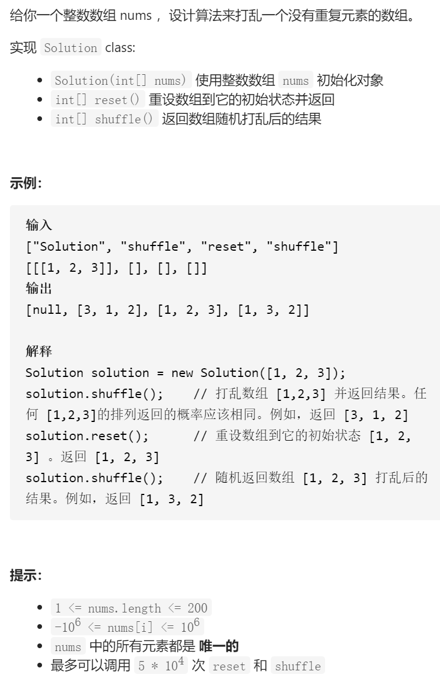

打乱数组



变量简洁正确完整思路

洗牌算法，将原数组打散，使原数组的某个数在打散后的数组中的每个位置等概率出现，评判标准是n个数字必须有n!种可能

1 2 3 4 5 

将nums[i]与nums[rand()% i+1]交换，则当i=4，任何数字在下标为4出现概率1/5

i--，当i=3，,任何数字在下标为3出现概率4/5 *  1/4，这里的4/5是因为下标0到3这4个数不会出现在下标为4

显然，下标4有5种可能，下标3有4种。。。最后有5*4*3*2*1=5!种可能

```c
class Solution {
public:
    vector<int>original;
    Solution(vector<int>& nums) {
        original=nums;
    }
    
    vector<int> reset() {
        return original;
    }

    vector<int> shuffle() {
        vector<int>ans(original);
        int i=ans.size()-1;
        while(i>=0){
            swap(ans[i],ans[rand()%(i+1)]);
            i--;
        }
        return ans;
    }
};
```

