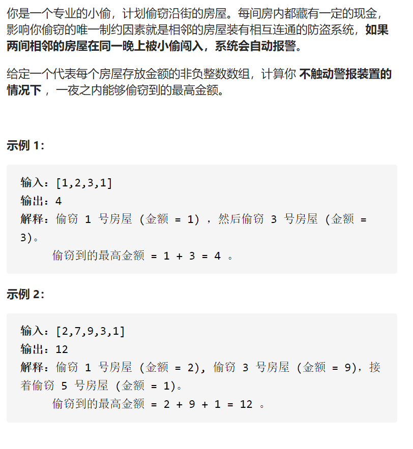

打家劫舍



变量间接正确完整思路

精确定义

dpi 到第i家最多钱，dp0表示空，dp1表示第一家

转移

2 7 9 3 1 dp i=maxdp i-1 dpi-2+val

初始化

dp0 =0 

dp1=nums[0]

```c
class Solution {
public:
    int rob(vector<int>& nums) {
        int n=nums.size();
        vector<int>dp(n+1,0);
        dp[1]=nums[0];
        for(int i=2;i<=n;i++){
            dp[i]=max(dp[i-1],dp[i-2]+nums[i-1]);
        }
        return dp[n];
    }
};
```


状态压缩，由于i只在左边，i-1，i-2只在右边，直接弄

```c
class Solution {
public:
    int rob(vector<int>& nums) {
        int n=nums.size();
        vector<int>dp(3,0);
        dp[1]=nums[0];
        for(int i=2;i<=n;i++){
            dp[i%3]=max(dp[(i-1)%3],dp[(i-2)%3]+nums[i-1]);
        }
        return dp[n%3];
    }
};
```


