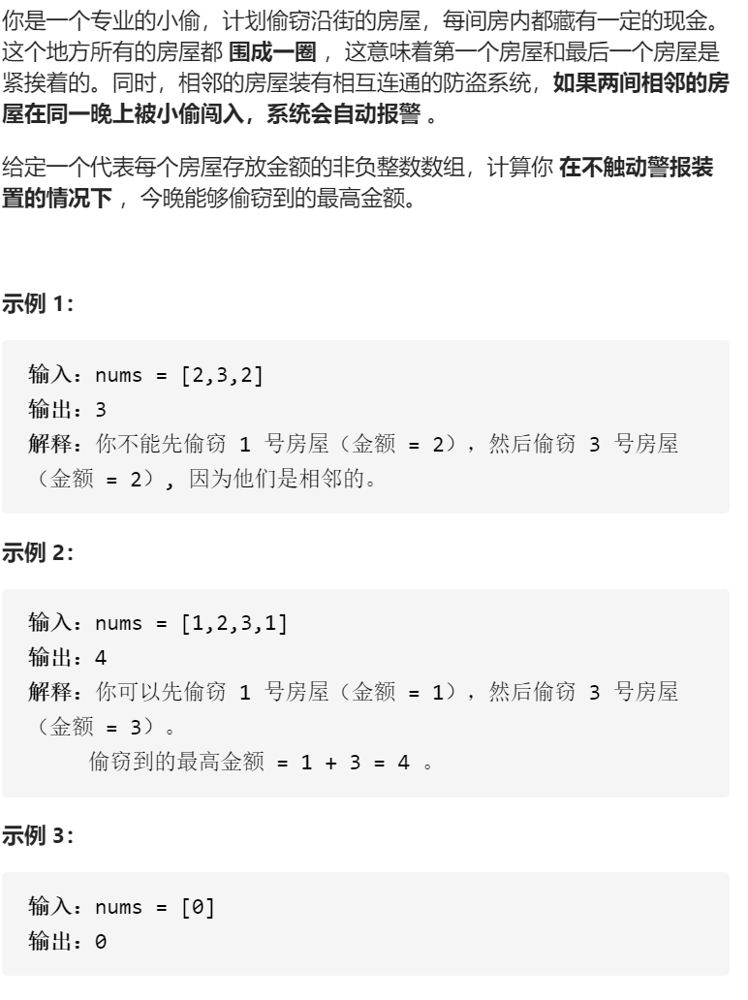

打家劫舍II

变量简洁正确完整思路

要么不要第一家，要么不要最后一家，

精确定义

dpi 到第i家，最高金额，dp0是第一家

转移

1 2 3 1 

dp i=maxdp i-1  dpi-2 +val 

初始化

dp 0=0

dp 1=val

dp 2=max val val

踩过的坑

  vector<int>dp(nums.size(),0);

大小不变，如果1-n-1就不要用dp[0]，综合用dp[beg]

​        dp[beg]=nums[beg],dp[beg+1]=max(nums[beg],nums[beg+1]);

dp0不是是空，而要是第一家，因为起点本就很混乱了，dpbeg代表第一家，dpbeg+1代表

第二家，已经很不容易了，不要在弄空，或者是01，而是beg，beg+1

```c
class Solution {
public:
    int rob(vector<int>& nums) {
        int n=nums.size();
        if(n==1)return nums[0];
        if(n==2)return max(nums[0],nums[1]);
        return max(dp(nums,0,n-2),dp(nums,1,n-1));
    }
    int dp(vector<int>&nums,int beg,int end){
        vector<int>dp(nums.size(),0);
        dp[beg]=nums[beg],dp[beg+1]=max(nums[beg],nums[beg+1]);
        for(int i=beg+2;i<=end;i++){
            dp[i]=max(dp[i-1],dp[i-2]+nums[i]);
        }
        return dp[end];
    }
};
```

状态压缩

```c
class Solution {
public:
    int rob(vector<int>& nums) {
        int n=nums.size();
        if(n==1)return nums[0];
        if(n==2)return max(nums[0],nums[1]);
        return max(dp(nums,0,n-2),dp(nums,1,n-1));
    }
    int dp(vector<int>&nums,int beg,int end){
        vector<int>dp(3,0);
        dp[beg]=nums[beg],dp[beg+1]=max(nums[beg],nums[beg+1]);
        for(int i=beg+2;i<=end;i++){
            dp[i%3]=max(dp[(i-1)%3],dp[(i-2)%3]+nums[i]);
        }
        return dp[end%3];
    }
};
```

