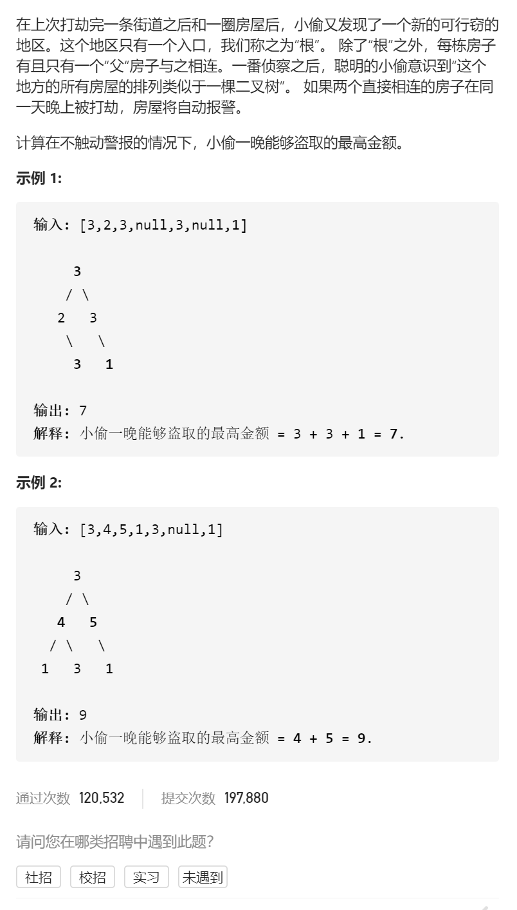

打家劫舍III

变量简洁正确完整思路

dfs，形参root返回root树最大金额，就是找最大值，偷root，不偷root->leftroot->right，再加上孙子树最大金额，大，还是，不偷root，再加上儿子树的最大金额，大，边界root为空，

```c
class Solution {
public:
    int rob(TreeNode* root) {
        return dfs(root);
    }
    int dfs(TreeNode*root){
        if(!root)return 0;
        int sum1=0;
        sum1+=root->val;
        if(root->left)sum1+=dfs(root->left->left)+dfs(root->left->right);
        if(root->right)sum1+=dfs(root->right->left)+dfs(root->right->right);
        int sum2=0;
        sum2+=dfs(root->left)+dfs(root->right);
        return max(sum1,sum2);
    }
};
```

变量简洁正确完整思路

记忆化搜索，计算root树最大金额用到了儿子孙子的金额可以保存memo unordered_map<TreeNode*

什么树,int的最大金额>


```c
class Solution {
public:
    unordered_map<TreeNode*,int>tree2ans;
    int rob(TreeNode* root) {
        return dfs(root);
    }
    int dfs(TreeNode*root){
        if(tree2ans.count(root))return tree2ans[root];
        if(!root)return 0;
        int sum1=0;
        sum1+=root->val;
        if(root->left)sum1+=dfs(root->left->left)+dfs(root->left->right);
        if(root->right)sum1+=dfs(root->right->left)+dfs(root->right->right);
        int sum2=0;
        sum2+=dfs(root->left)+dfs(root->right);
        tree2ans[root]=max(sum1,sum2);
        return tree2ans[root];
    }
};
```


变量简洁正确完整思路

滚动数组优化，dfs(root)返回{num1,num2}表示偷、不偷root节点的最大金额


```c
class Solution {
public:
    int rob(TreeNode* root) {
        vector<int>ans=dfs(root);
        return max(ans[0],ans[1]);
    }
    vector<int> dfs(TreeNode*root){
        if(!root)return {0,0};
        vector<int>left=dfs(root->left),right=dfs(root->right);
        int sum1=root->val+left[1]+right[1];
        int sum2=max(left[0],left[1])+max(right[0],right[1]);
        return {sum1,sum2};
    }
};
```


踩过的坑

 int sum2=max(left[0],left[1])+max(right[0],right[1]);

不偷root，则孩子偷、还是不偷，是不确定的，可能不偷孩子更多钱