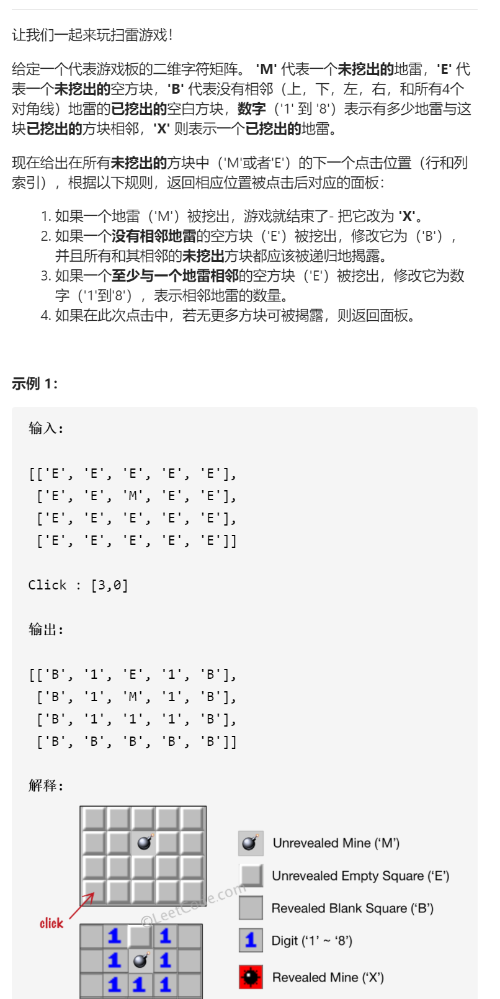
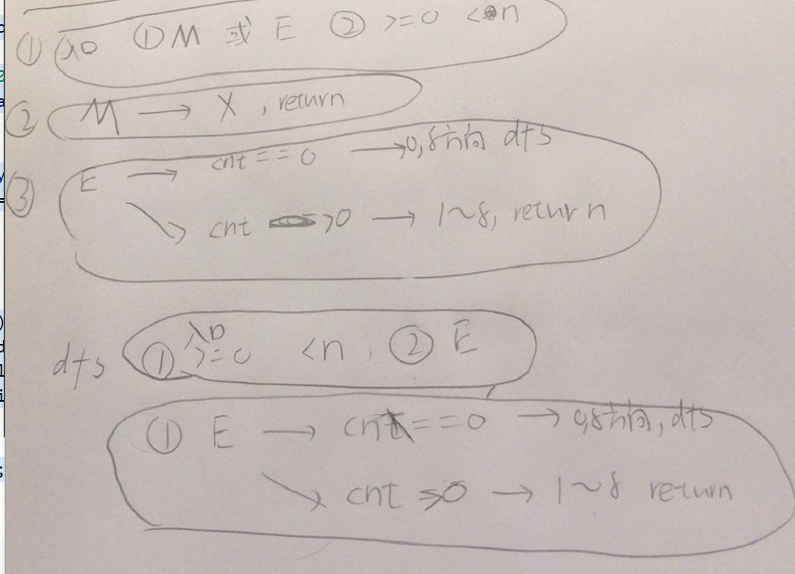

扫雷游戏



抽象图固定维护寻找



这个虽然能通过，但其实是错的，因为我把遇到E且cnt==0后递归调用八个方向

当作点击，但实际是揭露而不是点击

```c
class Solution {
public:
    int xx[8]={-1,-1,-1,0,0,1,1,1};
    int yy[8]={-1,0,1,-1,1,-1,0,1};
    vector<vector<char>> updateBoard(vector<vector<char>>& board, vector<int>& click) {
        int x=click[0],y=click[1];
        //cout<<x<<y<<endl;
        int n=board.size(),m=board[0].size();
        if(x>=0&&x<n&&y>=0&&y<m&&(board[x][y]=='M'||board[x][y]=='E')){
            if(board[x][y]=='M'){
                board[x][y]='X';
                return board;
            }
            else if(board[x][y]=='E'){
                int cnt=0;
                for(int i=0;i<8;i++){
                    int dx=xx[i]+x,dy=yy[i]+y;
                    if(dx>=0&&dx<n&&dy>=0&&dy<m&&(board[dx][dy]=='M'||board[dx][dy]=='X'))cnt++;
                }
                if(cnt==0){
                    board[x][y]='B';
                    //cout<<x<<' '<<y<<endl;
                    for(int i=0;i<8;i++){
                        int dx=xx[i]+x,dy=yy[i]+y;
                        vector<int>newClick={dx,dy};
                        updateBoard(board,newClick);
                    }
                }else if(cnt>0){
                    board[x][y]=cnt+'0';
                    return board;
                }
            }
        }
        return board;
    }
};
```

将点击换成dfs揭露，正确且效率上升

```c
class Solution {
public:
    int xx[8]={-1,-1,-1,0,0,1,1,1};
    int yy[8]={-1,0,1,-1,1,-1,0,1};
    vector<vector<char>> updateBoard(vector<vector<char>>& board, vector<int>& click) {
        int x=click[0],y=click[1];
        //cout<<x<<y<<endl;
        int n=board.size(),m=board[0].size();
        if(x>=0&&x<n&&y>=0&&y<m&&(board[x][y]=='M'||board[x][y]=='E')){
            if(board[x][y]=='M'){
                board[x][y]='X';
                return board;
            }
            else if(board[x][y]=='E'){
                int cnt=0;
                for(int i=0;i<8;i++){
                    int dx=xx[i]+x,dy=yy[i]+y;
                    if(dx>=0&&dx<n&&dy>=0&&dy<m&&(board[dx][dy]=='M'||board[dx][dy]=='X'))cnt++;
                }
                if(cnt==0){
                    board[x][y]='B';
                    //cout<<x<<' '<<y<<endl;
                    for(int i=0;i<8;i++){
                        int dx=xx[i]+x,dy=yy[i]+y;
                        vector<int>newClick={dx,dy};
                        dfs(board,newClick);
                    }
                }else if(cnt>0){
                    board[x][y]=cnt+'0';
                    return board;
                }
            }
        }
        return board;
    }
    void dfs(vector<vector<char>>&board,vector<int>&click){
        int x=click[0],y=click[1];
        int n=board.size(),m=board[0].size();
        if(x>=0&&x<n&&y>=0&&y<m&&board[x][y]=='E'){
            int cnt=0;
            for(int i=0;i<8;i++){
                int dx=xx[i]+x,dy=yy[i]+y;
                if(dx>=0&&dx<n&&dy>=0&&dy<m&&(board[dx][dy]=='M'||board[dx][dy]=='X'))cnt++;
            }
            if(cnt==0){
                board[x][y]='B';
                for(int i=0;i<8;i++){
                    int dx=xx[i]+x,dy=yy[i]+y;
                    vector<int>newClick={dx,dy};
                    dfs(board,newClick);
                }
            }else if(cnt>0){
                board[x][y]=cnt+'0';
                return;
            }            
        }
        return;
    }
};
```


