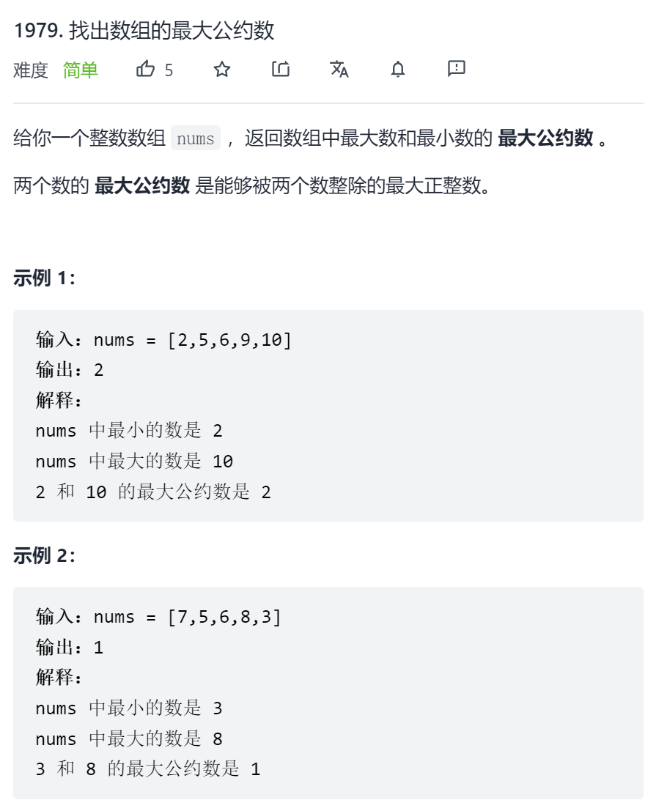

方法一：按要求计算
思路与算法

我们首先遍历数组 \textit{nums}nums 得到最大值与最小值后，再计算两者的最大公约数即可。

对于计算最大公约数的部分，\texttt{C++}C++ 与 \texttt{Python}Python 的标准库中都有计算两个整数最大公约数的函数。

最大公约数的求法

计算两个整数最大公约数 \text{gcd}(a, b)gcd(a,b) 的一种常见方法是欧几里得算法，即辗转相除法。其核心部分为：

\text{gcd}(a, b) = \text{gcd}(b, a\ \text{mod}\ b).
gcd(a,b)=gcd(b,a mod b).

代码

C++Python3

```c
class Solution {
public:
    int findGCD(vector<int>& nums) {
        int mx = *max_element(nums.begin(), nums.end());
        int mn = *min_element(nums.begin(), nums.end());
        return gcd(mx, mn);
    }
};
```

复杂度分析

时间复杂度：O(n + \log M)O(n+logM)，其中 nn 为 \textit{nums}nums 的长度，MM 为 \textit{nums}nums 的最大值。遍历数组寻找最大值与最小值的时间复杂度为 O(n)O(n)，计算最大公约数的时间复杂度为 O(\log M)O(logM)。

空间复杂度：O(1)O(1)。

